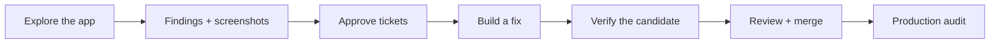

<p align="center">
  
</p>

<p align="center">
  <a href="https://github.com/AgentBurgundy/shipgremlins/actions/workflows/hub-ci.yml"></a>
  <a href="LICENSE"></a>
  <a href="docs/IMPLEMENTATION_STATUS.md"></a>
</p>

<p align="center">
  <a href="https://shipgremlins.ai"><strong>Meet ShipGremlins</strong></a> ·
  <a href="#get-started">Get started</a> ·
  <a href="docs/SETUP.md">Docs</a> ·
  <a href="docs/ROADMAP.md">Roadmap</a> ·
  <a href="https://shipgremlins.ai/brand.html">Brand kit</a> ·
  <a href="CONTRIBUTING.md">Join the crew</a>
</p>

# Your app's new night shift.

You build the product. Give a few gremlins a mandate to explore it.

**ShipGremlins gives AI product managers a real browser, a job to do, and a memory.** They click through your app, capture screenshots, and turn findings into Linear tickets. Developer agents work on approved tickets. The dispatcher checks the work, retries bounded failures, and prepares changes for your review.

Real browser evidence. Approved work. **Done means merged into production.**

> [!NOTE]
> **Early alpha.** The current stack is GitHub, GitHub Actions, Vercel, Linear, and Claude Code. You configure the test environment and credentials, and control staging and production merges. See [what is implemented](docs/IMPLEMENTATION_STATUS.md) before connecting a project.

## A particular set of nitpicks

One PM per mandate. Different obsessions. The same app.

<table>
  <tr>
    <td align="center" width="33%"><br /><strong>Security PM</strong></td>
    <td align="center" width="33%"><br /><strong>Feature PM</strong></td>
    <td align="center" width="33%"><br /><strong>Experience PM</strong></td>
  </tr>
  <tr>
    <td align="center">“Should this account be able to do that?”<br /><br />Roles, permissions, and access boundaries.</td>
    <td align="center">“What if I upload this?”<br /><br />Imports, edge cases, and broken flows.</td>
    <td align="center">“Try that on a phone.”<br /><br />Small screens, empty states, and awkward journeys.</td>
  </tr>
</table>

These are example mandates, not fixed agent types. Each area has its own instructions, feature inventory, queue, and memory. Start with one; add another when a different part of your product needs attention. [Create a mandate →](docs/add-a-project.md)

## From “that's weird” to shipped



| Step        | What actually happens                                                                                                                                      |
| ----------- | ---------------------------------------------------------------------------------------------------------------------------------------------------------- |
| **Explore** | Scheduled PMs use Playwright MCP to inspect the app. The fixture CLI creates CSVs and reproducible PNGs for upload testing.                                |
| **Approve** | Findings become Linear tickets. Developer agents receive approved work and open implementation PRs against `pm-staging`.                                   |
| **Recover** | The dispatcher monitors checks and retries recoverable failures within limits. When it cannot recover, it leaves an actionable blocker.                    |
| **Verify**  | Promotion gates check trusted verification receipts and the candidate revision before preparing a staging PR. You supply the trusted verifier.             |
| **Ship**    | You control staging and production merges. An explicit audit and reconciler tie completion to all approved deliverables merged into the production branch. |

**“Trust me” isn't a test.** Missing or stale evidence blocks promotion. A staging merge does not close a ticket. [Read the verification model →](docs/VERIFICATION.md)

## Get started

You need Git and **Node.js 22.12+**. Install the global CLI once, then open your private setup dashboard:

```bash
npm install -g git+https://github.com/AgentBurgundy/shipgremlins.git
gremlins setup
```

The dashboard opens in your browser with gremlins, project setup, and local connection-token entry. The `gremlins` CLI works from any directory; `shipgremlins` and `hub` remain compatibility aliases. Everyday commands do not need a source checkout or an `npm run` wrapper.

On a homelab server, run `gremlins setup --lan` and open the printed private-network link from your laptop or phone. Edit configuration in the dashboard and find both installation and settings folders under File locations. LAN mode uses HTTP on your trusted network; see the [server guide](docs/SETUP.md#server-use) for firewall and encrypted SSH-tunnel access.

Install future updates from the dashboard's **Updates** panel or with `gremlins update`. New code is staged and checked before activation; your existing projects, PM mandates, and credentials stay in place. The previous runtime remains available for rollback.

```bash
gremlins --help
```

Configuration lives in the nearest hub checkout, or `~/.shipgremlins` outside one. Use `gremlins --home PATH setup` to choose another location. Setup reuses the saved automation repository or detects its Git origin. `--hub-repo` is available for an explicit selection.

New PMs start disabled. Dashboard connections are saved locally; configure the runner's GitHub Actions secrets separately before enabling jobs. Follow the [setup guide](docs/SETUP.md) for provider connections, runner configuration, and the first agent run.

<details>
<summary><strong>Local credentials and live connection checks</strong></summary>

Save supported connection tokens through the dashboard. The CLI loads those keys from the configuration's local `.env`; exported variables take precedence. To load a different credentials file explicitly:

```bash
gremlins --env-file .env setup --check --project my-app
gremlins --env-file .env doctor my-app
```

`setup --check` is local and read-only. `doctor` contacts providers and stamps the project's local verification date on success. Use isolated staging accounts and synthetic test data.

Running the CLI or the local operator-help page does not start a background agent service. See [runner configuration](docs/runners.md).

</details>

## Production is Done

Verification is a milestone. Staging is a milestone. **Done means every approved deliverable is merged into the configured production branch.**

Start with a read-only audit:

```bash
gremlins tickets audit --project my-app --json
```

<details>
<summary><strong>Reconcile Linear status with production</strong></summary>

The audit reports tracked tickets, scope hashes, and actual team workflow IDs. Reconciliation requires an operator-reviewed manifest listing the complete deliverable set and corresponding production PRs:

```bash
gremlins tickets reconcile --project my-app --manifest /secure/release-scope.json
gremlins tickets reconcile --project my-app --manifest /secure/release-scope.json --apply
```

The first command is a dry run. Only `--apply` enables status writes. The reconciler reads actual merged PRs and Git trees; a comment, label, or deployment alone cannot close a ticket. Canceled tickets remain canceled. Ambiguous history, edited ports, and later changes to the same files remain flagged for review.

Read the [manifest format and limitations](docs/LINEAR_LIFECYCLE.md) before enabling writes. This is an explicit command today, not an automatic webhook service. Disable conflicting native completion automations when using it as the lifecycle authority.

</details>

## What works. What's next.

| Available in the alpha                        | On the roadmap                                     |
| --------------------------------------------- | -------------------------------------------------- |
| GitHub + Actions + Vercel + Linear            | GitLab CI + Railway adapters                       |
| Claude Code + Playwright MCP                  | Additional AI providers and connection management  |
| Self-hosted Linux runner support; GCE tooling | Simpler cloud provisioning and runner management   |
| Mandates, memory, CSV/PNG fixtures            | Richer generated fixtures and cleanup              |
| Bounded recovery and verified promotion gates | Durable coordination and broader recovery coverage |
| Production audit and explicit reconciliation  | Automatic production lifecycle hooks               |
| CLI setup and local preflight                 | An agent dashboard and guided onboarding           |

GCE tooling is included but has not been certified in a live environment. The landing page and local operator-help page are introductions and documentation; the management dashboard is planned.

[Implementation status](docs/IMPLEMENTATION_STATUS.md) · [Roadmap](docs/ROADMAP.md) · [Master plan](docs/MASTER_PLAN.md)

## Join the crew

Found a bug? Have a particular set of nitpicks? [Open an issue](https://github.com/AgentBurgundy/shipgremlins/issues/new/choose) or help with a focused fix. Setup feedback, reproducible failures, and tested integrations are especially useful right now.

```bash
npm test
npm run typecheck
npm run lint
```

Tests use fake providers and mocked HTTP responses; normal unit tests need no provider credentials. Read [CONTRIBUTING.md](CONTRIBUTING.md) before a larger change. If you want to follow the project, a GitHub star helps other builders find it.

## Field guide

| Start here                             | Go deeper                                                 |
| -------------------------------------- | --------------------------------------------------------- |
| [Setup](docs/SETUP.md)                 | [Verification and trust boundaries](docs/VERIFICATION.md) |
| [Runners](docs/runners.md)             | [Linear lifecycle](docs/LINEAR_LIFECYCLE.md)              |
| [Add a project](docs/add-a-project.md) | [CSV and image fixtures](docs/FIXTURES.md)                |
| [Operating guide](docs/README.md)      | [Launch plan](docs/OPEN_SOURCE_LAUNCH.md)                 |

Older operating documents use the original PM Hub name and describe the v1 workflow. The setup, verification, and lifecycle guides describe the current alpha; the master plan distinguishes the larger intended system.

---

<p align="center"><strong>Little monsters. Better software.</strong></p>

Copyright 2026 ShipGremlins contributors. [Apache-2.0](LICENSE). Third-party dependencies retain their respective licenses. Report vulnerabilities privately through [SECURITY.md](SECURITY.md).

<details>
<summary><strong>Public snapshot defaults</strong></summary>

This distribution contains generic configuration and no enrolled projects. Scheduled
PM and dispatcher workflows are gated by the repository variable
`SHIPGREMLINS_ENABLE_SCHEDULES=true`. Leave it unset until your private hub repository,
credentials, runner, test accounts, and enabled PM mandates have been reviewed.
Manual workflow dispatch remains available. Run `gremlins crons write` in your operational
hub after enabling areas; the public snapshot starts with an inert placeholder cron.

`gremlins setup` opens the local connection and project dashboard. The older
`npm start` command and Docker image serve an operator-help page. The public
marketing site is maintained separately.

</details>
