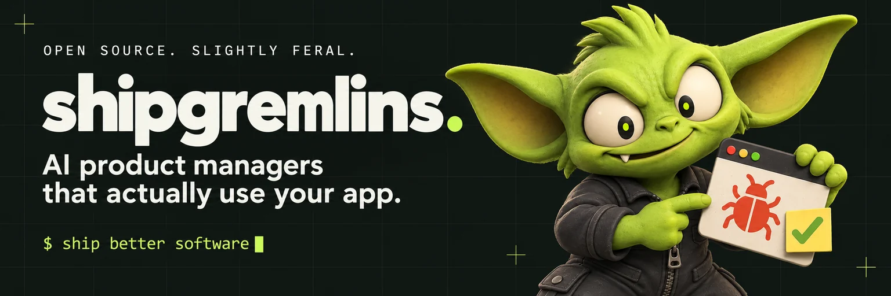
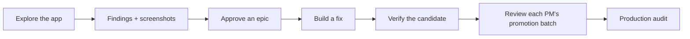

<p align="center">
  
</p>

<p align="center">
  <a href="https://github.com/AgentBurgundy/shipgremlins/actions/workflows/hub-ci.yml"></a>
  <a href="LICENSE"></a>
  <a href="docs/IMPLEMENTATION_STATUS.md"></a>
</p>

<p align="center">
  <a href="https://shipgremlins.ai"><strong>Meet ShipGremlins</strong></a> ·
  <a href="docs/WHEN_TO_USE.md">When to use it</a> ·
  <a href="#get-started">Get started</a> ·
  <a href="docs/SETUP.md">Docs</a> ·
  <a href="docs/ROADMAP.md">Roadmap</a> ·
  <a href="https://shipgremlins.ai/brand.html">Brand kit</a> ·
  <a href="CONTRIBUTING.md">Join the crew</a>
</p>

# AI product managers that actually use your app.

Give the app you already build a crew that keeps improving it.
Choose a useful outcome, let a PM investigate, and turn approved work into
reviewable code on your own runners.

**ShipGremlins gives AI product managers a job to do, a memory, and a browser when the project needs one.** They investigate repositories or explore a configured test environment and turn findings into Linear proposals. Docker workers run PMs and developers on your computer, homelab, or an enrolled remote machine. Developers implement approved tickets with explicit acceptance criteria. In the configured promotion workflow, an exact ready integration deployment triggers the owning PM's verification.

Real browser evidence. Approved work. **Done means merged into production.**

**Give PMs the signals behind the screen.** Connect Sentry logs and errors,
Datadog logs, and Mixpanel analytics so each PM can investigate its project's
failures and usage alongside browser evidence. Optional connections use scoped
reads and per-project credentials. [Connect project telemetry →](docs/TELEMETRY.md)

Sentry, Datadog, and Mixpanel have their own Connections cards. Configure project
scopes and each PM's Mixpanel report in the dashboard, then save credentials there.

**Keep the crew in your Slack channel.** PMs report their patrols; Coding Gremlins report implementation progress and blockers. Updates carry the project, mandate or ticket, and run number. [Connect Slack →](docs/SLACK.md)

> [!NOTE]
> **Early alpha.** Local Docker execution is the default: no fork, separate automation repository, GitHub Actions, or GitLab CI setup is required. New projects use epic approval and per-PM promotions. Finish Linear, agent-service and verified integration deployment setup before activating the crew. Source discovery can start earlier; explicit direct-PR projects can stay repository-only. Full live provider certification remains pending. You control promotion merges into staging and your normal production release. See [what is implemented](docs/IMPLEMENTATION_STATUS.md).

## When to bring in the gremlins

**When your app has more opportunities than you have time to pursue.** Start
with one outcome: make the first import easier, close an account-isolation gap,
or investigate a feature your current workflow is missing. You set direction;
the crew investigates and implements the work you approve.

| Where you are                          | Where ShipGremlins fits                                                                                                       |
| -------------------------------------- | ----------------------------------------------------------------------------------------------------------------------------- |
| An early codebase or working prototype | Give one PM a concrete goal and run repository discovery. A public launch is not required.                                    |
| An app with a growing backlog          | Approve a bounded epic. Coders implement its tickets, the owning PM tests them, and passing work becomes its promotion batch. |
| Several product areas to maintain      | Add PM mandates and schedules as the first proves useful. Keep work limits within your review capacity.                       |

Start with **one PM, one outcome, one useful change**. Your project home collects
integration checks, PM QA, coding follow-ups, promotion PRs, and the next improvement.
Browser investigations need a runnable test environment; repository discovery
can start before hosting and Linear setup. The Setup Gremlin helps prepare an
existing app for testing. PM patrol schedules and automatic approved-ticket coding
can be enabled independently.

[Try an improvement mission →](docs/IMPROVEMENT_MISSIONS.md) ·
[Find your starting point →](docs/WHEN_TO_USE.md)

Starting from nothing? [Idea builds are experimental](docs/IDEA_TO_APP.md).
They create a private-by-default repository and a reviewed foundation assignment.
A scaffold with passing checks is not proof of a polished, integrated product.

## A particular set of nitpicks

One PM per mandate. Different obsessions. The same app.

<table>
  <tr>
    <td align="center" width="33%"><br /><strong>Security PM</strong></td>
    <td align="center" width="33%"><br /><strong>Feature PM</strong></td>
    <td align="center" width="33%"><br /><strong>Experience PM</strong></td>
  </tr>
  <tr>
    <td align="center">“Should this account be able to do that?”<br /><br />Roles, permissions, and access boundaries.</td>
    <td align="center">“What if I upload this?”<br /><br />Imports, edge cases, and broken flows.</td>
    <td align="center">“Try that on a phone.”<br /><br />Small screens, empty states, and awkward journeys.</td>
  </tr>
</table>

These are example mandates, not fixed agent types. Each area has its own instructions, feature inventory, queue, and memory. Start with one; add another when a different part of your product needs attention. [Create a mandate →](docs/add-a-project.md)

**Get another perspective with Grumblins.** AI creates three simulated customers
from your project's purpose, PM briefs and learned context. Each has a relevant
goal, opinionated personality and patience budget. Choose one to try your test
app, then read its journey and the PM's proposed experiment. Observed friction,
simulated preferences and assumptions stay separate. [Meet your Grumblins →](docs/GRUMBLINS.md)

## From “that's weird” to shipped



| Step        | What actually happens                                                                                                                                                                                                                                                              |
| ----------- | ---------------------------------------------------------------------------------------------------------------------------------------------------------------------------------------------------------------------------------------------------------------------------------- |
| **Explore** | Scheduled PMs review the repository or use Playwright MCP against the selected test environment. The fixture CLI creates CSVs and reproducible PNGs for upload testing.                                                                                                            |
| **Approve** | Approve a bounded epic once. Its PM creates testable child tickets, and coders implement eligible work on your agent services. The controller owns internal drafts and merges into `pm-staging`.                                                                                   |
| **Recover** | Durable queues, bounded startup retries and cancellation preserve existing work. An ambiguous launch or publication is held for review, not blindly repeated.                                                                                                                      |
| **Verify**  | The controller checks and merges eligible coding drafts into integration. The owning PM tests the exact deployed app using independent browser receipts. Failed acceptance criteria return to a coder with evidence, with at most one automatic coding repair per original change. |
| **Ship**    | Each PM collects verified tickets into its own selective promotion to staging: 10 tickets by default, configurable per project or PM. Assembled checks must pass. You review the promotion, then use your normal production release process.                                       |

**“Trust me” isn't a test.** Missing or stale evidence blocks promotion. A staging merge does not close a ticket. [Read the verification model →](docs/VERIFICATION.md)

<a id="get-started"></a>

## Adopt your first gremlin

You need Git, **Node.js 22.12+**, and Docker running Linux containers. Install the global CLI once, then open your private setup dashboard:

```bash
npm install -g git+https://github.com/AgentBurgundy/shipgremlins.git
gremlins setup
```

The dashboard opens in your browser with gremlins, project setup, official GitHub/GitLab sign-in, and local connection-token entry. The `gremlins` CLI works from any directory; `shipgremlins` and `hub` remain compatibility aliases. Everyday commands do not need a source checkout or an `npm run` wrapper. [Connect source control →](docs/SOURCE_CONTROL.md)

Once the dashboard opens, choose where your gremlin will live:

- **An existing app:** choose **Improve my app** and connect its repository.
  The Setup Gremlin inspects the source and suggests commands and a first PM.
  Review the evidence, select the commands to keep, and choose **Confirm setup**.
  Then meet the suggested gremlin, review its brief, and adopt it. Optional
  Sentry, Mixpanel, and Datadog setup opens for this project. Choose **Explore
  the codebase** for the first read-only Discovery; use **What should get better?**
  afterward to start an outcome-focused mission. Automation stays paused.
  [Meet your first PM →](docs/SETUP.md#your-first-adoption)
- **A new idea:** choose **Start from an idea · experimental** and review the
  proposed foundation and crew. The new repository is private by default. A
  Coding Gremlin builds an initial draft; review its design, integrations and
  complete journey before merging. PMs explore after there is code.
  [Experimental idea builds →](docs/IDEA_TO_APP.md)

Source control and Claude Code are enough to prepare an existing app's PM;
Discovery also needs a ready worker. Save a Linear connection when you want
proposals or approved coding work; the PM prepares missing mappings and labels
using the project's selected account. Add a test environment when the gremlin needs to use a
runnable app in a browser. The Setup Gremlin can help choose hosted staging or
a disposable Docker app. [Find a test home →](docs/PROJECT_ONBOARDING.md)

The dashboard shows each crew's **Patrol plan** and separates finished runs from recorded browser activity, images and check results. To test ShipGremlins itself, use the [disposable dashboard Docker fixture](examples/dashboard-test/README.md): the real UI and configuration handlers with clearly simulated integrations, no real credentials or Docker socket.

Separate pages keep Connections, Projects, Your gremlins, Activity, and Settings
focused. Provider cards contain setup instructions and token creation links.
Connect Slack once for the workspace; every project inherits that channel unless
you deliberately configure an override.

Each project also has its own sidebar link and workspace. Open a PM to edit its
product brief and review its discovery, feature inventory, ranked opportunities,
and learned memory together. The repository and PM name stay visible while you work.

Project **Proposals**, **Changes**, **Your crew**, and **Settings** keep decisions,
results, shared knowledge, and setup in separate views. The workspace inbox
shows what needs attention and links to the remedy. [Use the control room →](docs/PROJECT_OPERATIONS.md)

Retire a project or PM from its own workspace with **Delete**. Review the impact
and type its identifier to confirm. Settings keeps a recovery list; restored PMs
start paused. Connections also lets you remove unused saved accounts and clear
saved tokens. Git repositories, Linear resources, and run history stay intact.
A deleted PM's visible ID can be reused for a fresh, paused PM with separate
learned context and delivery ownership; its old recovery copy remains available.
[Delete, disconnect, and restore →](docs/RESOURCE_LIFECYCLE.md)

On a homelab server, run `gremlins setup --lan` and open the private launch link once to set a dashboard password. Then bookmark the normal server URL; **Remember this device** keeps your browser signed in. HTTPS is supported through a local reverse proxy. Plain HTTP on a trusted private LAN requires an explicit setup choice and does not encrypt passwords or sessions. See the [server guide](docs/SETUP.md#server-use) for sign-in, HTTPS and SSH-tunnel access.

Install future updates from the dashboard's **Updates** panel or with `gremlins update`. New code is staged and checked before activation; your existing projects, PM mandates, and credentials stay in place. The previous runtime remains available for rollback.

An update banner appears on every dashboard page when a release is available,
with installation and restart controls. Update details and rollback live in Settings.

```bash
gremlins --help
```

Configuration lives in the nearest existing configuration directory, or `~/.shipgremlins` outside one. Use `gremlins --home PATH setup` to choose another location. Add your app repository directly; local mode does not require `--hub-repo`.

Follow the next assignment's setup steps. Discovery needs source control, Claude
Code, and a ready worker; a regular PM run also needs Linear. Missing mappings and
required connection verification can be prepared when you start that run.
The worker runs on the CLI/dashboard server, even when you
visit from a phone. Ready requires actual Chromium screenshot evidence.

New PMs start with both automation controls paused. Choose **Explore the codebase** on the
welcome screen for Discovery, or **Prepare first mission** to finish its setup.
Discovery needs no Linear or browser environment. A fresh idea starts with
**Build the foundation** instead. For later patrols, choose **Run now** on a PM
card or its workspace without turning on its schedule. Missing
setup opens a checklist for that PM with direct actions. Review Activity, then
enable **Look for new improvements** for scheduled patrols or **Automatically
build approved work** for approved-ticket pickup. These controls are independent.
Turning either off stops its new automatic work; manual runs remain separate. A manual
Coding run still requires an open, approved ticket in the PM's Linear project.
For new managed projects, that ticket must be a native child of a currently
approved epic. **Activate ready crew** can enable the ready PMs and coding together;
it does not approve any epic. [Complete workflow and recovery diagrams →](docs/AUTONOMOUS_WORKFLOW.md)

New projects and existing projects without PMs offer **Find my gremlins**. AI
investigates the repository and suggests one to five PMs with distinct product
responsibilities, source evidence and complete editable briefs. Choose **Adopt**,
review the brief and confirm; remaining suggestions stay available. This source
investigation does not test the running app, create a generic starter PM or enable
automation. [Connect an app and choose its crew →](docs/PROJECT_ONBOARDING.md)

To define another responsibility yourself, choose **Adopt a PM Gremlin** on your
project's page. Describe what it should
take care of and choose **Meet my gremlin**, or **Write the brief myself**. AI fills
blank fields and default controls with a suggested name, ID, grounded ownership,
shared touchpoints, metric, UTC schedule, WIP limit, and complete product brief:
ambition, goal, measurement, users, expected capabilities, non-goals, guardrails,
and priorities. Your original mandate and existing edits are preserved. Review
the gremlin's name and proposed job, then adopt it separately. AI fill uses repository
paths and existing PM ownership; it does not read file contents, invent provider
IDs, change Linear, enable automation, or run a patrol.

The project page puts PM controls first, with focused tabs for setup, review,
and project knowledge. Open any run for separate **Summary**, **Activity**,
**Output**, and **Artifacts** tabs. Live refreshes keep your tab and reading
position; closing the viewer leaves the worker running.

**Let the PM learn the codebase first.** A **Discovery** run reads the actual
repository and produces a feature map, ranked opportunities, and durable notes
for later patrols. It needs source access, Claude Code, and a ready Docker worker;
Linear and hosting setup can come later. Discovery does not file tickets, publish
code, enable automation, or rewrite your brief. Give the PM ambition, users,
success measures, priorities, guardrails, and non-goals in its **Product brief**.
Owner direction stays separate from what the PM learns. [PM workflow →](docs/PM_WORKFLOW.md)

Discovery can propose source-backed commands and ownership settings. Review the
evidence and apply each suggestion explicitly; discovery never enables automation.

Connect GitHub or GitLab with a device code in **Source control**, then select your repository. GitHub requires installing the App on the repositories you choose. The controller manages token refresh and waits when active work still needs the old credential. Existing manual tokens and self-hosted GitLab remain available as advanced setup options.

Connect Linear from the dashboard. New apps can create a Linear team, and each PM mandate gets its own Linear project. Existing mappings are preserved and interrupted provisioning resumes with the same IDs. [Connection and mapping guide →](docs/LINEAR_VERCEL.md)

In **Environment → App sign-in**, enter a dedicated test account and choose
**Connect & test**. Source inspection supplies the login recipe; the assigned
agent service verifies it in a private browser before a PM starts. Password forms,
modals and typed multi-step recipes are supported. Runs reserve the account and
independent QA signs in afresh. Email codes, MFA and external SSO still need
dedicated adapters; public or synthetic-fixture coverage does not prove real login.
[Set up test accounts →](docs/TEST_ACCOUNTS.md)

**Different clients, different accounts.** Save multiple named Linear and Vercel
connections, then select the account each project uses. One app can use your own
Linear team and Vercel installation while another uses a client's workspace and
Railway. The project editor keeps its name and repository visible and lets you
repair Linear team/PM mappings without moving or deleting provider resources.

**Any repository first. Hosting when you need it.** New projects default to `pm-staging → staging → main`; discovery can start with repository checks before browser setup. Automatic PM QA needs a verified integration deployment. Choose the explicit pull-request workflow if you want to review individual coding drafts instead. Edit the install/test/build commands for your stack. Add a named preview or staging environment, or select Vercel, Railway, or Cloud Run discovery. Credentials belong in Connections; resource IDs and settings belong to each project. Existing projects have **Edit settings**, with conflict protection and preserved unrelated configuration. [Project and hosting guide →](docs/PROJECTS.md)

The local runtime provisions its PostgreSQL activity store when preparing work. The dashboard retains visible tool activity, summaries, checks, logs, and bounded artifacts. Private model reasoning is not exposed. Slack delivery runs separately from job execution and records each attempt so restarts do not repeat messages.

Keep the controller running after you close the terminal:

```bash
gremlins start --lan
gremlins status
gremlins stop
```

Omit `--lan` for a local-only dashboard. Stop pauses scheduling; already-running Docker jobs continue. For unattended restart after a server reboot, use the [service-manager example](docs/SETUP.md#restart-after-a-server-reboot).

Need capacity on another machine? Create a project-scoped enrollment under
**Your gremlins**, then run `gremlins worker` there using the displayed command.
Workers connect outbound to the controller. Linux, Windows and macOS hosts use
Linux Docker containers; native iOS simulation is not supported yet.
[Remote worker setup →](docs/REMOTE_WORKERS.md)

<details>
<summary><strong>Local credentials and live connection checks</strong></summary>

Save supported connection tokens through the dashboard. The CLI loads those keys from the configuration's local `.env`; exported variables take precedence. To load a different credentials file explicitly:

```bash
gremlins --env-file .env setup --check --project my-app
gremlins --env-file .env doctor my-app
```

`setup --check` is local and read-only. `doctor` contacts providers and stamps the project's local verification date on success. Use isolated staging accounts and synthetic test data.

`gremlins setup` runs the dashboard and controller in the foreground. `gremlins start` runs them in the background. The old static operator-help page is separate. See [local workers and advanced CI runners](docs/runners.md).

</details>

## Production is Done

Verification is a milestone. Staging is a milestone. **Done means every approved deliverable is merged into the configured production branch.**

For promotion projects, **Delivery** tracks drafts, deployment, PM review and
selective promotion. The managed epic workflow derives each child ticket's finite
delivery scope from its verified promotion and audits actual production merges
before closing it in Linear. Legacy/manual completion declarations remain available.
It never merges production for you. [The complete workflow and recovery flowcharts →](docs/AUTONOMOUS_WORKFLOW.md)

Start with a read-only audit:

```bash
gremlins tickets audit --project my-app --json
```

<details>
<summary><strong>Reconcile Linear status with production</strong></summary>

The audit reports tracked tickets, scope hashes, and actual team workflow IDs. Reconciliation requires an operator-reviewed manifest listing the complete deliverable set and corresponding production PRs:

```bash
gremlins tickets reconcile --project my-app --manifest /secure/release-scope.json
gremlins tickets reconcile --project my-app --manifest /secure/release-scope.json --apply
```

The first command is a dry run. Only `--apply` enables status writes. The reconciler reads actual merged PRs and Git trees; a comment, label, or deployment alone cannot close a ticket. Canceled tickets remain canceled. Ambiguous history, edited ports, and later changes to the same files remain flagged for review.

Read the [manifest format and limitations](docs/LINEAR_LIFECYCLE.md) before enabling writes. The CLI remains explicit; the dashboard polls only production scopes you have confirmed. Disable conflicting native completion automations when using it as the lifecycle authority.

</details>

## What works. What's next.

| Available in the alpha                                                   | On the roadmap                                                                  |
| ------------------------------------------------------------------------ | ------------------------------------------------------------------------------- |
| Local Docker jobs with GitHub/GitLab and optional browser targets        | Full live provider certification and broader deployment automation              |
| Direct URLs; Vercel, Railway and Cloud Run discovery                     | Provider provisioning and broader staged promotion support                      |
| Claude Code + Playwright MCP                                             | Additional AI providers and connection management                               |
| Sentry + Datadog project logs; Mixpanel Insights                         | Broader telemetry queries and live certification                                |
| Branded PM/developer Slack updates and local PostgreSQL activity history | Broader team collaboration and distributed queue coordination                   |
| Persistent queue, local/remote Docker workers, logs and artifacts        | Automatic OS service installation, native macOS jobs and cloud fleet management |
| Mandates, memory, CSV/PNG fixtures                                       | Richer generated fixtures and cleanup                                           |
| Bounded recovery, project limits and PM-reviewed selective promotion     | Automatic candidate environment provisioning and broader recovery coverage      |
| Production audit and owner-confirmed scope reconciliation                | Production lifecycle webhooks                                                   |
| Global CLI, LAN dashboard, config editor and background controller       | Richer agent editing and deployment orchestration                               |

Repository-only projects open drafts for you to merge. Explicit promotion projects
can advance eligible approved fixes into the integration branch and have the owning
PM review them. Staging and production remain owner-controlled. The older GitHub
Actions workflows and GCE tooling remain advanced options; GCE and the complete
GitLab/Railway stack have not been live-certified.

[Implementation status](docs/IMPLEMENTATION_STATUS.md) · [Roadmap](docs/ROADMAP.md) · [Master plan](docs/MASTER_PLAN.md)

## Join the crew

Found a bug? Have a particular set of nitpicks? [Open an issue](https://github.com/AgentBurgundy/shipgremlins/issues/new/choose) or help with a focused fix. Setup feedback, reproducible failures, and tested integrations are especially useful right now.

```bash
npm test
npm run typecheck
npm run lint
```

Tests use fake providers and mocked HTTP responses; normal unit tests need no provider credentials. Read [CONTRIBUTING.md](CONTRIBUTING.md) before a larger change. If you want to follow the project, a GitHub star helps other builders find it.

When changing the runner image or packaged installation, also run
`node runner-local/runtime-permissions-smoke.mjs` with Docker available. It builds
from owner-only source files to check that the non-root runtime can still read its
scripts and start its browser.

## Field guide

| Start here                                         | Go deeper                                                    |
| -------------------------------------------------- | ------------------------------------------------------------ |
| [Setup](docs/SETUP.md)                             | [Verification and trust boundaries](docs/VERIFICATION.md)    |
| [Runners](docs/runners.md)                         | [Linear lifecycle](docs/LINEAR_LIFECYCLE.md)                 |
| [Add a project](docs/add-a-project.md)             | [CSV and image fixtures](docs/FIXTURES.md)                   |
| [Operating guide](docs/README.md)                  | [Launch plan](docs/OPEN_SOURCE_LAUNCH.md)                    |
| [Project control room](docs/PROJECT_OPERATIONS.md) | [Selective delivery](docs/DELIVERY_WORKFLOW.md)              |
| [Remote workers](docs/REMOTE_WORKERS.md)           | [Disposable reference app](examples/reference-app/README.md) |

Older operating documents use the original PM Hub name and describe the v1 workflow. The setup, verification, and lifecycle guides describe the current alpha; the master plan distinguishes the larger intended system.

---

<p align="center"><strong>Little monsters. Better software.</strong></p>

Copyright 2026 ShipGremlins contributors. [Apache-2.0](LICENSE). Third-party dependencies retain their respective licenses. Report vulnerabilities privately through [SECURITY.md](SECURITY.md).

<details>
<summary><strong>Public snapshot defaults</strong></summary>

This distribution contains generic configuration and no enrolled projects. Local
Docker mode schedules enabled, verified areas through the local controller.
The optional legacy PM and dispatcher workflows are gated by the repository variable
`SHIPGREMLINS_ENABLE_SCHEDULES=true`. Leave it unset until your private hub repository,
credentials, runner, test accounts, and enabled PM mandates have been reviewed.
Manual workflow dispatch remains available. Run `gremlins crons write` in your operational
hub after enabling areas; the public snapshot starts with an inert placeholder cron.

Do not enable the legacy workflow schedules for a project already scheduled locally.
`gremlins setup` opens the local connection and project dashboard. The older
`npm start` command and Docker image serve an operator-help page. The public
marketing site is maintained separately.

</details>
