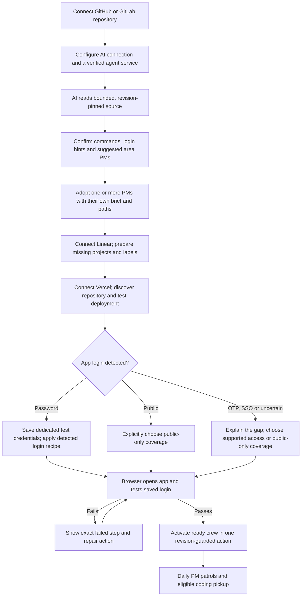
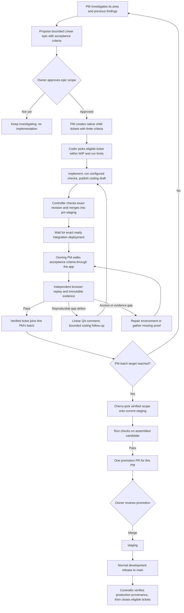
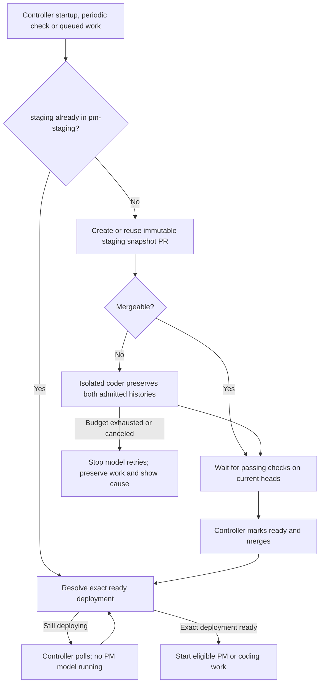
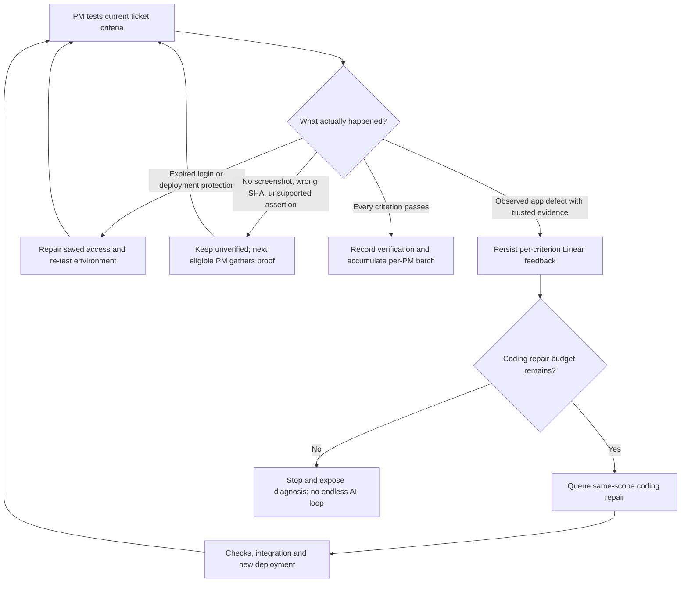

# The autonomous crew workflow

ShipGremlins improves an existing application through area-specific PMs. In the
managed promotion workflow, the owner approves **epic scope** and **each PM's
final promotion PR**. Coding drafts, merges into `pm-staging`, staging syncs,
bounded conflict repairs and individual ticket QA are crew operations.

The normal development team keeps using `staging` and `main`. ShipGremlins never
merges production. The team's usual production release process stays in place.

## 1. Connect the app and activate its crew



Source inspection suggests up to four PMs from the code it actually reads. It
retains the remaining suggestions after each adoption. These are proposals for
roles and setup, not proof that the application works. Password fields, routes
and signed-in controls can supply a login recipe; uncertain or incomplete
detection remains visible. ShipGremlins cannot create a valid application account
or infer its password. Store dedicated test credentials in Connections.

Vercel deployment protection and application sign-in are separate checks. The
controller resolves the preview and protection access; the browser must still
sign into the app. A saved token, reachable URL or detected selector does not
qualify as a passed login test. A changed credential or environment invalidates
its saved verification. Public-only coverage never claims signed-in verification.

Repository-only discovery can run before Linear and hosting setup. Repository-only
projects do not need a test account. The complete browser delivery loop requires
a ready integration deployment whose provider reports its exact Git SHA. A fixed
URL without deployment provenance cannot certify that a particular fix was tested.

Activation validates every PM before writing any automation switches. If one PM
is missing its mapping, mandate, schedule, worker or browser access, the crew stays
paused and setup names the missing step. Activation does not approve an epic.

## 2. From an idea for improvement to a promotion



An epic uses `pm-epic` and starts as `pm-proposal`. Approval in ShipGremlins writes
a controller-owned receipt for the exact epic scope and owning PM. PM-written
labels or comments cannot supply that authority. The PM uses Linear's native
parent relationship for coding tickets and may apply `pm-approved` to finite
children within the approved scope. A changed parent, epic scope, mandate,
repository or mapping requires current approval again. Native scope/ownership
checks are enforced in code; judging whether a child's product requirements fit
the epic also depends on PM reasoning and subsequent QA.

The default `workflow.promotionBatchSize` is **10 distinct tickets**. An area's
`promotionBatchSize` overrides it; both accept 1–100. Repeated implementations or
QA repairs of one ticket count once. Verified work releases a coding WIP slot so
a two-ticket WIP limit can still build a ten-ticket promotion. Coding, unresolved
QA and blocked work retain their slots. A manual preparation can flush a smaller
batch; it does not waive checks or verification. The controller can also open a
smaller **prerequisite batch** when that PM's verified changes must reach staging
before another PM's verified shared-file work can ship. The PR labels this
exception; it preserves PM ownership and every QA/check gate, preventing the
normal batch target from deadlocking dependent areas.

Each area owns its promotion. Work from another PM is not silently bundled in.
Shared-file dependencies and selective cherry-pick conflicts hold affected work
until its prerequisites reach staging or a bounded isolated port passes fresh
owning-PM QA. A port gets one attempt for the ticket, preserves its original
approval and consumed QA-repair allowance, and never changes staging directly.
Its standalone source must match the actual integration code the PM tests.
If unrelated changes cannot be isolated safely, the attempt stops with its
scope/proof limitation instead of repeatedly running agents.

If an open promotion conflicts with newer staging, the controller rebuilds only
its recorded source set. When a source needs a port, it closes the exact unchanged
controller-owned PR, preserves it in delivery history, and collects a fresh
checked replacement after QA. Rebuilding keeps that earlier batch eligible even
below the normal target. An unrecognized or user-edited PR head is preserved.
Existing combined promotions remain
visible as legacy history instead of being reassigned to a new PM.

## 3. Staging moves or a merge conflicts



Staging sync gets at most two automatic conflict-repair attempts per staging
revision. An implementation can get one pre-merge integration repair and one
additional coding repair after genuine failed QA. Repairs retain the original
approved scope. The controller serializes integration repair families so its own
unrelated merges do not invalidate the admitted baseline. A verified replacement
can close its exact superseded implementation PR; branches and history are kept.

Temporary provider failures retry with durable state. After a lost merge response,
the controller checks whether the merge already happened before trying again.
Human-required integration branch rules are reported as a setup issue; no agent
silently changes repository protections. `pm-staging` is disposable working space,
but that does not justify losing either branch's history.

## 4. QA fails, login fails, or evidence is incomplete



The controller posts an idempotent QA report to the mapped Linear ticket with
criteria, result, tested commit/deployment and evidence references. Lost provider
responses are reconciled before repeating comments. It updates QA labels, not
approval labels or Done. A failed comment write does not erase the durable
review or prevent an otherwise valid bounded repair.

Browser recipes are replayed after the model container stops, in a separate
container without model or source-control credentials. Each criterion gets a
fresh browser context. Responsive UI criteria request mobile **390×844** and
desktop **1280×800** with `viewports: ["mobile", "desktop"]`; all requested
views must pass. Missing access is not evidence that application code is broken.

## Configuration and migration

```json
{
  "workflow": {
    "kind": "promotion",
    "approvalPolicy": "epic",
    "promotionBatchSize": 10
  },
  "branches": {
    "integration": "pm-staging",
    "staging": "staging",
    "production": "main"
  }
}
```

New projects use this policy. Existing projects keep their existing approval
policy; an omitted `approvalPolicy` retains the legacy ticket behavior. Select
epic approval deliberately in project settings when migrating, and establish
native parent epics for new coding work. Existing direct-PR projects still end
with human-reviewed coding drafts. Their behavior is not silently changed.

Schedulers require the dashboard/controller and an eligible agent service to be
running. Budgets, explicit owner holds, review-only charters, missing credentials
and reserved automation-control paths remain real boundaries. Recovery is bounded;
“hands off” means routine operations are automatic, not that every provider outage
or unresolved product decision is fixable by an agent.

This design follows CrewOS's recover → test → plan loop, epic-to-milestone policy,
mobile-first QA and per-area selective promotions. ShipGremlins additionally
enforces current approval receipts, exact deployment identity, independent replay,
durable retries and configurable batch targets. See [delivery details](DELIVERY_WORKFLOW.md)
and [setup](SETUP.md).
