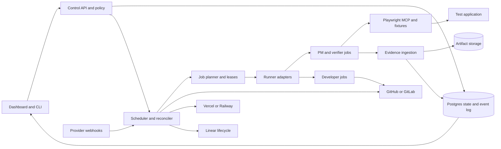

# PM Hub master plan

Updated October 4, 2026. Status: planning baseline for the next version; implementation has not started under this plan. PM Hub remains the working project name.

PM Hub should give a developer a persistent team of AI product managers and developers. Each PM owns a mandate, explores the real application, records evidence, proposes useful work, and verifies improvements. Developers implement approved Linear tickets in the background. A deterministic controller manages execution, recovery, and promotion. The owner keeps building while the system handles routine work and surfaces decisions that actually need attention.

The first priority is trustworthy completion: verified changes reach staging through a controlled promotion, and a Linear ticket becomes **Done only when its required changes have merged into the configured production branch**. More agents are valuable only when their work is correct, coordinated, and affordable.

This plan expands the original v1 design (historical context, excluded from this distribution), which deliberately excluded GitLab, Railway, and a dashboard. That document remains historical context. Nothing here silently changes an existing project's permissions, schedules, approval policy, or integrations.

## Planning documents

| Document                                    | Purpose                                                                    |
| ------------------------------------------- | -------------------------------------------------------------------------- |
| This master plan                            | Product requirements, architecture, trust boundaries, and acceptance gates |
| [Linear lifecycle](LINEAR_LIFECYCLE.md)     | Production completion, workflow states, release tracking, and migration    |
| [Delivery roadmap](ROADMAP.md)              | Ordered implementation work, dependencies, and release criteria            |
| [Open source launch](OPEN_SOURCE_LAUNCH.md) | Name and domain candidates, landing page brief, packaging, and launch      |
| [Current operating guide](README.md)        | How the existing implementation works today                                |

## Requirements from the owner

| Requirement                                | What the finished system must demonstrate                                                                                  |
| ------------------------------------------ | -------------------------------------------------------------------------------------------------------------------------- |
| Reliable, self-healing operation           | Recover bounded failures without duplicate work or bypassing release gates                                                 |
| Promote only fully tested work             | No promotion PR or MR opens until the exact release candidate satisfies its required checks and deployed acceptance tests  |
| Dynamic PMs for different web applications | Create mandates through the dashboard or CLI; configure capabilities and application access without editing shared prompts |
| Real browser interaction                   | Drive Playwright MCP, inspect actual screenshots, and retain reproducible evidence                                         |
| Generate testing inputs                    | Create images, CSVs, and other fixtures, upload them through the application, and check the resulting behavior             |
| Background development                     | Implement approved Linear tickets with bounded parallelism while the owner works independently                             |
| Easy self-hosting                          | One bootstrap command starts a persistent local/server installation and opens a setup wizard                               |
| Dashboard control                          | Manage connections, PMs, developers, runners, budgets, activity, evidence, approvals, and failures                         |
| Both existing environments                 | GitHub + Actions + Vercel and GitLab + GitLab CI + Railway pass the same conformance suite                                 |
| Local and cloud runners                    | Reuse self-hosted runners and support ephemeral GCP workers with cleanup and cost limits                                   |
| Open-source launch                         | A clear public repository, useful docs, a polished landing page, and a memorable name                                      |
| Honest Linear completion                   | Implementation and QA remain active states; Done requires a production merge                                               |

## What exists today

Repository audit: commit `bf2e90a`, October 4, 2026. Local validation passed: **271 tests across 24 test files**, TypeScript checking, and ESLint. These checks establish a code baseline; they do not prove live operation against either deployment stack.

| Area                | Existing implementation                                                                                 | Next-version gap                                                                                                        |
| ------------------- | ------------------------------------------------------------------------------------------------------- | ----------------------------------------------------------------------------------------------------------------------- |
| Controller          | TypeScript sync, stop-the-line, heal, repair, merge, dispatch, and promotion rules in `src/dispatcher/` | Durable state, leases, authenticated evidence, recovery lane, and explicit transitions                                  |
| Integrations        | GitHub forge; Linear, Vercel, Slack clients                                                             | GitLab/Railway adapters; separate source-control, CI, hosting, and execution contracts                                  |
| PMs                 | Per-area mandates, schedules, queues, inventories, and memory branches                                  | Dashboard authoring, schema versioning, capability policies, shared knowledge, overlap control                          |
| Browser             | Pinned Playwright MCP setup, screenshots, and artifact collection in `pm-agent.yml`                     | Validated evidence ingestion, deployment identity, role matrix, fixture and visual inspection contracts                 |
| Developers          | Claude Code workflows for builds and repairs                                                            | Provider-neutral runtime; scoped credentials and tools; reproducible job specifications                                 |
| Promotion           | Cherry-picks verified changes onto per-area release branches; local command checks                      | Full candidate browser verification before PR creation; literal whole-branch promotion option; stale evidence rejection |
| Setup               | `add-project`, config validation, `doctor`, cron generation                                             | Installable package/service, resumable wizard, connection management, backup/upgrade path                               |
| Runners             | Self-hosted and GCE resolution, workflows, Packer image, startup cleanup                                | Live GCE certification, GitLab executor support, fleet health, independent cleanup                                      |
| Linear completion   | Labels and comment conventions; no production completion reconciler found                               | Release provenance and deterministic status updates                                                                     |
| Public distribution | Private npm package and operating docs                                                                  | Root entry point, license decision, sanitized examples, releases, contribution guide, website                           |

### Reliability findings to fix first

These are observations from code inspection, not claims that a particular live incident occurred.

1. **Verification is currently a comment convention.** `verdictOf` in `src/dispatcher/promote.ts` selects the latest matching comment body. Candidate collection does not authenticate its author or bind it to a deployment, commit, acceptance criteria revision, or artifact manifest. A comment must become a presentation of evidence, not authorization to release.
2. **Red-line recovery can block itself.** `checkLine` creates an approved repair ticket, but `runDispatcher` skips normal dispatch while the line is stopped, and `runMerge` also blocks merges. A dedicated repair lane must be able to dispatch and land a verified repair while ordinary work remains paused.
3. **Absence of failure is treated as integration health.** `checkLine` checks explicit failed checks and `ERROR` deployment state. Pending/missing checks, missing deployments, and a deployment for another SHA do not establish that the current branch is healthy. Use `healthy`, `waiting`, `unhealthy`, and `unknown` states; only healthy opens normal gates.
4. **The assembled release does not have a mandatory deployed verification gate.** `PromoteOpts.check` is optional at the module boundary. The CLI supplies install/typecheck/test commands, but the configured lint command and an explicit application build are absent from this check sequence. If staging itself fails, the code restores the assembled batch and can continue toward a promotion PR. Fail closed and test the actual final candidate.
5. **Stale or forged success needs stronger handling.** Existing check aggregation lacks an explicit expected-check set. Require named checks from trusted publishers, at the correct revision; unrelated green checks or skipped mandatory tests must not satisfy a gate.
6. **Claims are not transactional.** Dispatching a job, adding a Linear label, and recording its run happen through separate API writes. A crash between them can cause uncertainty or duplication. Introduce durable intents, deduplication keys, reconciliation, and run leases.
7. **A queued/running job can wait indefinitely from the healer's perspective.** `heal.ts` intentionally leaves live provider runs alone. Add heartbeat, queue-age, and progress deadlines, then reconcile provider state before replacing a worker.
8. **Policies live too much in prompts.** Guard tests, self-approval, and tool scope require controller enforcement. The PM prompt also contains conflicting tier-C approval language; generate agent guidance from one policy source.
9. **Operational docs have drift.** The old design says promotions never force-push, while the current rebuild path uses force-with-lease. Existing runner price tables and setup versions are historical. Replace claims with tested behavior and current measurements during implementation.

## Product boundaries and default decisions

The product target is framework-independent web software with configured environments and accounts. The first certified applications should include both a client-heavy application and a server-rendered application, plus authenticated multi-tenant flows and asynchronous/file-processing flows. Onboarding detects capabilities and reports unsupported requirements explicitly; it cannot promise complete coverage of every possible application without setup.

Proposed defaults for new installations:

- A PM may explore authorized test environments, create findings, draft tickets, and verify changes. A developer may implement approved scope. A controller decides whether transitions are allowed.
- Approval means an owner-approved ticket or an explicit standing policy for a bounded class of tickets. A PM cannot grant itself new authority. Existing self-approval remains a visible legacy policy until deliberately migrated.
- Automatic merges may reach `pm-staging` after checks. Humans retain staging and production merge authority initially, matching the current operating model.
- Production exploration is optional, read-only, and separately configured. Mutation, security probing, test-account setup, and fixture uploads occur in isolated test environments.
- Safety and correctness rules never depend on model obedience alone. Missing evidence causes waiting or a block with a precise reason.
- User code, mandates, memory, provider choices, and artifacts remain exportable. Core self-hosting requires no vendor-operated PM Hub account.

The launch goal is a demonstrably useful open-source product. Acquisition value, viral reach, and linear productivity gains from ten PMs are hypotheses, not requirements or forecasts.

## System architecture

Preserve the deterministic dispatcher and its scenario tests. Gradually extract reusable services around it instead of replacing working behavior in one rewrite.



### Control service and persistence

Recommended initial deployment: one TypeScript control service, PostgreSQL, a durable artifact volume, and separate disposable workers. A React dashboard can be served with the service. Keep the existing CLI as a client and compatibility entry point. Select the HTTP/UI libraries in an implementation design after the domain contracts are stable; no UI framework is required for the release gate.

Use Postgres for schedules, execution state, transactions, and a job/outbox queue initially. Introduce another queue system only if measured load requires it. The scheduler enqueues durable work, workers obtain expiring leases, and a reconciler compares desired state with provider state after restarts and missed events. Retries are at-least-once with idempotent effects, not a claim of exactly-once network delivery.

Store projects, connections, secret references, PM definitions and versions, policies, ticket approvals, jobs, attempts, leases, findings, evidence, changes, release manifests, deployments, audit events, and notification delivery records. Separate intended actions from observed results. Every event includes project, run, actor, timestamp, and correlation identifiers.

Config has a single authority: versioned controller records with import/export to files. In legacy CI-only mode, files remain authoritative. A project cannot have both modes writing its schedules or dispatching jobs at once. Migrate one project at a time, pause its old scheduler, import state, reconcile in read-only mode, then enable the new controller.

### Provider contracts

| Contract                | Responsibility                                                                             | First implementations                                                         |
| ----------------------- | ------------------------------------------------------------------------------------------ | ----------------------------------------------------------------------------- |
| `SourceControlProvider` | Repos, branches, commits, PR/MR diffs, merge outcomes, protections, trusted checks         | GitHub and GitLab                                                             |
| `ExecutionProvider`     | Start, inspect, cancel, and fetch artifacts from a job with a correlation ID               | GitHub Actions, GitLab CI, local worker                                       |
| `HostingProvider`       | Deploy/locate exact revisions, await readiness, inspect health/logs, identify environments | Vercel and Railway                                                            |
| `AgentRuntime`          | Tool loop, streaming events, structured output, cancellation, usage, model capabilities    | Existing Claude Code; OpenAI-backed runtime; later compatible/local providers |
| `TicketProvider`        | Issues, approvals, workflow state IDs, links, release membership, comments                 | Linear first                                                                  |
| `EnvironmentRecipe`     | Accounts, seed/reset hooks, migrations, databases, test service endpoints                  | Explicit project recipes with optional provider helpers                       |
| `ArtifactStore`         | Private upload/download, checksums, retention, access control                              | Local volume; S3-compatible storage and GCS adapters later                    |

Normalize semantics in the core but keep provider-specific capabilities visible. GitLab paths can contain subgroups and self-managed base URLs; do not reuse the current `owner/name` validation unchanged. GitLab mergeability, pipeline state, approvals, and MR numbers need explicit mappings, not GitHub-shaped string comparisons.

Each adapter must implement timeouts, retry classification, pagination, rate-limit handling, redaction, typed errors, and a conformance suite. Separate hub/control-repository credentials from target-repository credentials so targets can span different organizations or forges.

### Required environment recipes

| Stack                        | Required behavior and acceptance evidence                                                                                                                                                                       |
| ---------------------------- | --------------------------------------------------------------------------------------------------------------------------------------------------------------------------------------------------------------- |
| GitHub + Actions + Vercel    | GitHub App identity; scoped target tokens; branch or explicit pre-PR deployment; exact deployment ID/commit; private-preview browser access; approved-ticket to production completion                           |
| GitLab + GitLab CI + Railway | Configurable GitLab host/project ID; least-privilege bot/token; pipelines and artifacts; Railway environment/service bindings; exact source revision recorded at deployment; equivalent MR and ticket lifecycle |

Vercel distinguishes a deployment-specific URL from a moving branch URL. Verification should use the former and record the source commit. Automation bypass belongs in secret handling and request setup, never in shared evidence URLs. Sources: [generated URLs](https://vercel.com/docs/deployments/generated-urls), [automation bypass](https://vercel.com/docs/deployment-protection/methods-to-bypass-deployment-protection/protection-bypass-automation).

Railway environment duplication includes service configuration and variables. Treat copying or seeding database contents, storage, identities, queues, and external services as a separate, verified recipe; configuration duplication is not sufficient evidence of safe data isolation. GitLab CI can be designed to deploy a checked-out revision through Railway's CLI/API, so this integration must not depend on an assumed GitLab native auto-deploy feature. A successful build command alone is insufficient: poll deployment health and verify the revision. Sources: [Railway environments](https://docs.railway.com/environments), [CLI deployment](https://docs.railway.com/cli/deploying).

Environment checks must establish isolated credentials, mail/payment sandboxes, webhook destinations, storage, worker processes, queues, migrations, and test accounts. A failed required migration blocks verification. Record configuration and fixture versions alongside code. For multi-service apps, record the full revision/deployment vector, not only the frontend SHA. Database choice must not be fixed to Neon.

## Promotion and verification contract

“Fully tested” means every mandatory acceptance criterion and policy check has evidence for the actual candidate. It does not mean the system has proven that software contains no defects. A missing account, unreachable service, blocked assertion, or untested mandatory criterion is never a pass.

### Promotion mode

The owner's requested default is a literal **`pm-staging` → `staging` PR/MR**. A direct branch PR includes the entire delta, so the complete delta must qualify. One verified ticket cannot justify promoting unverified neighbors.

Proposed sequence:

1. Integrate approved developer changes into `pm-staging`, serialize merges, and re-evaluate checks as the integration base changes.
2. Bring in the current staging base and establish a promotion lease. Freeze integration merges and sync writes for the candidate's review window; developers may continue on isolated branches.
3. Record the integration head, staging base, full change manifest, policy version, acceptance revisions, environment/configuration versions, and required checks.
4. Deploy and test that candidate before opening the staging PR. Branch-triggered or explicit candidate jobs must work without a PR already existing.
5. Run the independent verifier with clean accounts/fixtures against the recorded deployment. Retain browser screenshots, assertions, relevant logs, and test outputs.
6. The controller validates evidence, check identities, approval scope, artifacts, and unchanged branch/environment versions. Only then open the promotion PR/MR and publish a mandatory release-verification check.
7. Keep the source frozen while the promotion is open. If either branch, relevant environment, acceptance criteria, or candidate content changes, invalidate the check and close/supersede the proposal until re-verification passes. Never append unverified content to an already approved proposal.
8. The owner merges into staging; record provenance and perform staging smoke checks. Production remains a separate owner-controlled promotion. Track its merge to update Linear.

The freeze is an explicit throughput tradeoff for literal branch-to-branch promotion. Show its owner and expiry in the dashboard. On expiry or cancellation, withdraw the proposal and release the freeze; never merge automatically to clear a queue. Enforce this through provider protections and controller credentials, not a database flag alone.

The existing selective `pm-release/...` cherry-pick mechanism may remain as an explicitly configured legacy mode during migration. A future snapshot/selective mode can reduce blocking across many PMs, but it must independently test the assembled candidate and its dependency closure. File overlap and cherry-pick success alone cannot prove independence. It must not silently replace the requested direct-branch behavior.

### Required evidence

An authenticated verification record contains:

- Project, ticket/change IDs, run and attempt IDs, verifier identity, and policy/mandate versions.
- Source head, staging base, candidate tree hash, and release-manifest digest.
- Deployment IDs, tested URLs, observed revision at start/end, relevant configuration and migration versions.
- Each acceptance criterion's ID/revision, expected result, observed result, and `passed`, `failed`, or `blocked` outcome.
- Required test/check names, trusted publisher identities, revisions, execution IDs, and outputs.
- Account roles, tenant fixtures, viewport/browser information, and deterministic fixture hashes/seeds.
- Screenshot/trace/log artifact references, checksums, timestamps, and retention state.

Only trusted verification jobs submit authoritative records through scoped credentials. Developers cannot approve their own verification, overwrite prior evidence, edit policy, or satisfy the gate by writing a success comment. The controller validates metadata against provider observations; model prose alone never suffices. Review summaries should distinguish observed facts, interpretation, and untested scope.

Require relevant unit/integration tests, build, lint/type checks where configured, independent acceptance tests, regression smoke tests, and security checks appropriate to the diff. Check modifications to protected tests and CI configuration deterministically. Legitimate changes need an explicit owner exception; never weaken a gate as a repair strategy.

For RBAC, test authorized and unauthorized roles, anonymous access, cross-tenant access, direct API/resource access, and denial without side effects. Hiding a button is not evidence of authorization enforcement. Cover session expiration and permission changes where relevant. Browser-only evidence cannot establish backend security; combine UI behavior with safe API assertions in the authorized test environment.

## Recovery and hands-off operation

Use a persisted state machine with retry budgets scoped to the incident/revision. Ordinary work waits when the line is unhealthy. A narrowly scoped recovery lane can dispatch a repair and merge it only after its own checks and isolated verification pass. This resolves the current recovery deadlock without declaring an unhealthy base safe.

| Failure                     | Automatic response                                                            | Stop condition                                                    |
| --------------------------- | ----------------------------------------------------------------------------- | ----------------------------------------------------------------- |
| API timeout/rate limit      | Backoff with jitter; honor retry timing; resume durable intent                | Bounded retry/deadline or revoked access                          |
| Worker disappears           | Inspect provider run, expire lease, fence old worker, resume/retry checkpoint | Repeated failure or uncertain irreversible side effect            |
| Dispatch result unknown     | Find job by correlation ID before retrying                                    | Cannot establish whether work is already running                  |
| Queue starvation            | Detect age; diagnose labels/capacity; route to an allowed pool                | No permitted capacity or budget                                   |
| Red integration             | Pause normal merges; reserve capacity for a repair; re-test health            | Repair budget exhausted or unsafe migration recovery              |
| Merge conflict/base changed | Refresh base; bounded conflict repair; invalidate old evidence                | Repeated semantic conflict or protected scope                     |
| Browser/session expired     | Recreate context and reauthenticate using the test recipe                     | Repeated login failure or human-only challenge                    |
| Stale/failed deployment     | Await exact revision; retry transient build/deploy within budget              | Broken configuration or deterministic application failure         |
| Flaky test                  | Preserve first failure; bounded rerun and reproducibility analysis            | Mandatory assertion remains flaky; never mark green by exhaustion |
| Artifact upload failure     | Resume upload and verify checksum/access                                      | Required evidence remains unavailable                             |
| Duplicate finding           | Link to existing issue using normalized reproduction/signature                | Uncertain match requires PM review, not duplicate ticket spam     |
| Provider/model unavailable  | Use an owner-configured compatible fallback with remaining budget             | No approved equivalent capability                                 |
| Orphan VM/environment       | Independent janitor deletes expired owned resources                           | Resource ownership is uncertain                                   |

Initial proposed budgets: one infrastructure retry, up to two code-repair attempts per incident, and a per-project rolling repair/spend cap. Make values configurable and distinguish a new base revision from repeatedly retrying the same failure. Reserve recovery capacity so ten active PMs cannot starve the repair that unlocks them.

Persist progress and use fencing tokens so a late worker cannot publish after replacement. Manual cancellation is terminal until explicitly resumed. Emergency stop revokes new jobs and privileged writes, cancels active work where possible, and keeps evidence readable. Report meaningful state changes and actionable exceptions; suppress repeated unchanged alerts.

Automatic rollback is allowed only under an explicit project policy with a validated recovery recipe. Data migrations and external side effects may require forward fixes. Production operations retain owner control in the initial release.

## Dynamic PMs and tool capabilities

### Creating and managing a PM

The dashboard and CLI should accept a request such as “Create an onboarding PM focused on signup completion.” The system reads the app/repository inventory, proposes routes, ownership, goals, accounts, test scenarios, cadence, and cost, then saves a versioned mandate. A PM starts in observe-only mode unless an existing standing policy already authorizes its execution scope.

The definition includes purpose, success metric, boundaries, route/file ownership, shared dependencies, role/tenant matrix, schedule and timezone, exploration depth, ticket/WIP quotas, approval policy, model/runtime, capabilities, budgets, and memory policy. Provide security, feature, onboarding, accessibility, reliability, and growth templates; these are editable starting points.

AI may propose splitting a large mandate or adding a missing specialization. Activation and agent counts remain bounded by owner policy and project budgets. No unrestricted recursive creation. Mandates can be paused, cloned, revised, archived, or compared across versions. Owner direction outranks learned memory.

### Browser and fixture workflow

Use Playwright MCP as the exploratory browser interface the owner requested. Its official tool surface includes screenshots and local-file uploads. The capability smoke test must confirm the selected runtime actually receives and can inspect screenshot images, rather than only storing a filename. Source: [Playwright MCP](https://github.com/microsoft/playwright-mcp).

Proposed loop: map the app → choose a scenario → establish role/tenant and fixtures → execute UI/API actions → inspect screenshots and assertions → record findings → clean up. Use accessibility structure for reliable targeting and screenshots for visual assessment. Preserve reproducible discoveries as versioned regression tests run by an independent verifier.

| Capability        | Required implementation and test                                                                                                                                                                        |
| ----------------- | ------------------------------------------------------------------------------------------------------------------------------------------------------------------------------------------------------- |
| CSV/JSON data     | Seeded synthetic records, schema validation, edge cases, file metadata, upload, imported-row/error assertions                                                                                           |
| Images            | Deterministic fixture images for ordinary upload tests; configured image-generation provider when semantic content matters; inspect bytes/dimensions/type; upload and validate preview/crop/persistence |
| Documents         | Optional PDF/text/spreadsheet generation plugins with bounded size and known expected content                                                                                                           |
| Authentication    | Separate contexts for each role/tenant; password, test OTP/mailbox, or approved storage-state recipes; secret references only                                                                           |
| Async workflows   | Poll business outcomes with deadlines; test background workers/webhooks using sandbox endpoints                                                                                                         |
| API inspection    | Read/write only within configured test scope; validate permissions and side effects                                                                                                                     |
| Visual checks     | Desktop/mobile screenshots and responsive/accessibility assertions; optional cross-browser runs                                                                                                         |
| Exports/downloads | Download and parse output, compare expected content, record checksums, and remove temporary files                                                                                                       |

Example acceptance journey: generate a 100-row CSV with valid and invalid rows, upload through the app, confirm preview validation, import valid rows, inspect row counts and rejected records, verify a second tenant cannot see them, export and compare results, then clean up. A generated image follows the same lifecycle. Generated fixtures must never be presented as screenshots of observed application behavior.

Capabilities are pinned, versioned, allowlisted tools. Agents may select installed tools but cannot install arbitrary MCP servers or expand credentials/network access by themselves. If a capability is missing, file an actionable setup request and mark affected verification blocked. Local file generation does not require an external model; optional image generation carries a separate provider/cost policy.

### Coordination across ten or more PMs

Keep per-PM durable memory plus a shared application map of routes, features, contracts, and known findings. Store provenance and expiry; invalidate knowledge affected by changes. Use ticket/finding deduplication, declared dependencies, shared-touchpoint locks, weighted fair scheduling, and project-level WIP limits. Preserve product priority and dependency order instead of using only ticket age.

PMs may explore concurrently when fixtures and accounts are isolated. Serialize changes to shared test data or use per-run tenants. Serialize integration merges and promotion decisions. Track conflicting mandates and consolidate cross-area work into one owner and one ticket. Human changes on staging follow the same synchronization and evidence invalidation rules; agents must not undo them to restore an obsolete expectation.

## Linear workflow and release ownership

The detailed contract is in [Linear lifecycle](LINEAR_LIFECYCLE.md). Its core progression is:

```text
Proposed → Approved → In Progress → In Review → In QA
→ Verified → In Staging → Done
```

`Verified` means acceptance passed in the test environment. `In Staging` means the relevant promotion merged into staging. **Done requires production merge evidence for every required deliverable.** Blocked and Canceled are distinct outcomes. Failed verification returns work to repair without throwing away its history.

Separate developer capacity from release state. A ticket waiting for production remains open in Linear but must not consume a developer execution slot. `pm-verified` is a testing label, never a synonym for Done.

The controller carries ticket-to-change-to-release mappings across merge, squash, cherry-pick, and port operations. It consumes forge events and periodically reconciles against production history. It updates team-specific Linear state IDs through idempotent writes. Existing PR/MR automations must be reconciled with this rule so they cannot close tickets on `pm-staging` or staging merges.

Deployment health is separate from the owner's requested completion rule. A production merge may mark the ticket Done while deployment is pending; show `production merged`, `deploying`, `deployed`, or `deployment failed` beside it. A failed deploy raises a release incident and cannot be described as successfully shipped. A code revert that removes the delivered work reopens the affected work or creates an explicitly linked recovery item according to project policy.

## Dashboard and installation experience

### Dashboard surfaces

| Surface        | What the owner can see or do                                                                              |
| -------------- | --------------------------------------------------------------------------------------------------------- |
| Overview       | PM activity, useful findings, approved backlog, release readiness, failures, cost, and next action        |
| Projects       | Stack bindings, environments, role accounts, health, branch protections, setup progress                   |
| PMs and agents | Create/revise mandates, model/tools, schedules, quotas, memory, run history, pause/resume                 |
| Work           | Linear-linked lifecycle, approval provenance, dependencies, developer and release queues                  |
| Run detail     | Live action timeline, screenshots, browser traces, tool results, tests, concise decision summaries, costs |
| Releases       | Exact candidate, gate checklist, ticket manifest, held work, diffs, evidence, staging/production state    |
| Connections    | AI providers, GitHub/GitLab, Vercel/Railway, Linear, artifact storage, notifications                      |
| Runners        | Pools, availability, queue age, heartbeats, capacity, VM lifecycle, cleanup, versions                     |
| Settings       | Access roles, policy, budgets, retention, backups, upgrades, export, emergency stop                       |

“Thought logs” means a useful activity and decision record: agent plans, actions, observations, tool calls/results, concise rationale summaries, and outcomes. Do not promise private model chain-of-thought or fabricate it when a provider does not expose it. Redact secrets and tenant data before persistence or display, and enforce project-level access on logs and screenshots.

Design the dashboard around “What is happening, why is it waiting, and what needs me?” Use a clear visual hierarchy, readable timelines, evidence thumbnails, real empty/error states, keyboard navigation, responsive layouts, and accessible contrast. The public landing page has a separate design brief.

### Proposed CLI experience

The following commands are **product design examples, not currently shipped commands**. Package/binary naming follows the final brand decision; retain `hub` compatibility.

```bash
pm-hub up
pm-hub doctor
pm-hub project add
pm-hub pm create --project my-app
pm-hub runner join
pm-hub status
pm-hub pause --project my-app
pm-hub backup
pm-hub upgrade
```

`up` checks Docker/Compose and ports, creates persistent storage and a bootstrap admin secret, starts the service/database, and opens the local wizard. An already installed binary plus supported container runtime is the one-command prerequisite; installing Docker or obtaining provider credentials cannot be silently skipped. Support Linux servers first and Windows/macOS through a documented container/WSL path. Validate that a reboot restores service and state.

The wizard is resumable: create owner login → connect AI runtime → connect source control and CI → select hosting environment → connect Linear and map states → define test accounts/data → choose runner → create the first PM → run a dry-run and browser smoke test → enable its schedule. Preflight failures identify exactly which capability is blocked.

Start localhost-bound. Remote hosting requires an authenticated URL and TLS. Workers can poll outbound so a local installation does not need public ingress; webhooks are an optional authenticated acceleration with polling reconciliation as a fallback. Protect webhook handlers with signatures/secrets, replay protection, project binding, and deduplication.

Store secrets encrypted with the master key outside the database, support external secret references, and avoid passing unrelated credentials to jobs. Document key backup/rotation and what is unrecoverable if it is lost. Backups must include database, artifact index/content, and separately protected encryption material. Test restore and upgrade rollback before advertising hands-off hosting.

## Runner deployment and isolation

The control service schedules and observes work. Agent execution happens in isolated containers or VMs, whether launched locally, by Actions, by GitLab CI, or on GCP. Do not run untrusted target builds inside the control service or give them its container socket, master key, or broad cloud credentials.

| Mode                                       | Intended use                                       | Required certification                                                                           |
| ------------------------------------------ | -------------------------------------------------- | ------------------------------------------------------------------------------------------------ |
| Local/container worker                     | First self-hosted install and private network apps | Scoped enrollment, isolated workspaces, restart recovery, browser support, cleanup               |
| Existing self-hosted Actions/GitLab runner | Reuse user's machines and CI                       | Generated pinned job template, toolchain preflight, secrets isolation, cancellation              |
| Provider-hosted CI runner                  | No persistent agent infrastructure                 | Supported image/toolchain, runtime limits, artifacts, private-environment connectivity           |
| Ephemeral GCP worker                       | Bursts and stronger per-job isolation              | OIDC federation, least-privilege launcher, one-job worker, bounded capacity, independent janitor |

Use a job envelope containing a pinned runtime image, command/task specification, repo revision, scoped secret references, limits, artifact destination, correlation ID, and lease token. Build hooks are arbitrary target code and receive only the privileges needed for their phase. Separate developer and verifier credentials; only the controller may publish release authorization.

For GCP, use Workload Identity Federation from the chosen CI provider and give the launcher cloud provisioning permissions. Worker identities should not inherit broad instance-management access merely to delete themselves; prefer controller/janitor cleanup. The current GCE code is a starting point, not evidence of a live-tested fleet. Sources: [Google deployment-pipeline federation](https://docs.cloud.google.com/iam/docs/workload-identity-federation-with-deployment-pipelines), [GitHub runners](https://docs.github.com/en/actions/reference/runners/self-hosted-runners), [GitLab runner fleet guidance](https://docs.gitlab.com/runner/fleet_scaling/).

Require CPU/memory/disk/time limits, per-project parallelism and spend caps, network rules, clean browser profiles, dependency caches separated from secrets, image patching, and post-run cleanup. Do not execute untrusted public-fork jobs with privileged credentials. Keep the control plane available if every worker is lost.

## Security and operational trust

The application under test, screenshots, downloaded files, repository content, and ticket comments can contain hostile instructions. Treat these as task data. They cannot change owner policy, approved destinations, secret access, or release rules. Enforce tool and network boundaries outside the model, including metadata-service restrictions where applicable.

Use dashboard owner/operator/viewer roles and project-scoped authorization on every API and artifact request. Log connection changes, approvals, policy revisions, job actions, evidence changes, and merges. Scope security PMs to authorized targets and synthetic test identities. Use sandbox mail, billing, and notifications to prevent tests contacting real customers.

Before public release, inspect repository history and examples for secrets, personal data, private project identifiers, and credentials in URLs/logs. Preserve existing private project configuration while preparing sanitized public examples. Publish a security reporting policy and threat model. Plugin contributions get the same permission and supply-chain review as core tools.

## Quality, cost, and success measures

Proposed alpha targets below are product gates to measure, not current results:

| Measure             | Target and method                                                                                                                                  |
| ------------------- | -------------------------------------------------------------------------------------------------------------------------------------------------- |
| Promotion integrity | Zero promotion authorizations with stale/missing/forged mandatory evidence in adversarial conformance tests                                        |
| Ticket integrity    | Zero pre-production Done transitions; multi-change, squash, backport, cancellation, and revert cases pass                                          |
| Recovery            | Every injected supported fault either recovers within budget or reaches one actionable block without duplicate effects                             |
| Stack parity        | Complete approved-ticket → verified promotion → production completion on both required stacks                                                      |
| Setup               | First screenshot-backed finding within 30 minutes on a prepared reference app with credentials available; report provider/admin waiting separately |
| Restart safety      | Resume jobs and reconcile external state after control-service restart; stale workers cannot publish                                               |
| Scale               | Ten PMs complete a defined daily workload with bounded queues/cost and no conflicting data mutations; publish actual concurrency and timings       |
| Evidence            | Every verified acceptance criterion has valid structured evidence; every visual criterion has a real screenshot                                    |
| Product value       | Track accepted findings, false positives, duplicates, regressions prevented, and owner review time                                                 |
| Release quality     | Track production regressions, time to detect/recover, and successful deployed outcomes separately from Done counts                                 |

Meter model input/output usage where available, image generation, browser/runner minutes, deployment minutes, storage, and egress. If a subscription runtime cannot expose money spent, show usage and explicitly unknown/estimated cost rather than zero. Reserve budgets before dispatch and account for retries and parallel reservations.

Daily capacity planning starts with `PM count × runs per day × average run duration`, then adds developer, verifier, and repair work. Measure median and tail duration before choosing runner sizes. Use shallow routine sweeps, deeper scheduled audits, and change-triggered verification. Ten PMs must share a project budget; adding agents cannot multiply spend invisibly.

## Delivery order and remaining decisions

### Local execution decision — October 4, 2026

The accepted default is `gremlins setup` → save connections → choose the app repository → **Create runner on this machine** → browser-verified Ready. Use `--lan` for a homelab. The machine is the CLI/dashboard server, not the device displaying its dashboard. GitHub and GitLab hold app source; **the local controller and Docker execute jobs directly**. No fork, automation repository, provider CI registration, or CI secret provisioning is required for this path.

Implemented foundations include a durable local queue, per-worker concurrency one, up to four slots, idempotent scheduled/ticket work, approval rechecks before launch, PNG-backed browser verification, pause/drain/repair/remove controls, and retained logs/artifacts. `gremlins start`, `status`, and `stop` manage a detached controller. Existing containers survive controller stops and updates; a returning controller inspects them before proceeding. A pre-launch infrastructure failure gets one retry; failed agents are not blindly replayed.

Local developers propose draft integration PRs/MRs after configured checks. They do not merge, promote staging, or mark tickets Done. Signed promotion and explicit production-reconciliation tools remain separate. Full local release parity, durable shared-memory updates, cloud execution, automatic OS service installation, and live GitHub/GitLab/Railway certification remain work to complete. Disable legacy CI schedules when migrating a project locally.

The following **optional advanced CI fleet** work is independent of local setup:

1. **Machine readiness and worker image.** Detect the server platform/architecture, Docker availability, disk and available capacity. Package the Linux worker with Node, Git, provider tools, Claude runtime, Playwright and Chromium dependencies. Use the same worker environment on Linux and through Docker's Linux VM on Windows/macOS. Report concrete missing prerequisites before provisioning. Use a dedicated job workspace; do not mount the operator's home or credential store wholesale into jobs.
2. **Provider enrollment.** Validate the selected repository and the connection's actual permissions. Fetch supported runner distributions and verify their checksums. GitHub registration/JIT credentials and GitLab runner-authentication tokens require separate adapters. Persist each provisioning step and the provider runner ID so retries reconnect or repair the same worker instead of producing duplicates. See the official [GitHub runner API](https://docs.github.com/en/rest/actions/self-hosted-runners) and [GitLab automation guide](https://docs.gitlab.com/tutorials/automate_runner_creation/).
3. **Required credentials, once.** Expand dashboard connection setup to cover GitHub App installation/auth or the selected GitLab instance, plus required model, Linear and hosting credentials. Determine missing permission scopes and per-project secrets. Provision the provider's CI secret/variable store when that path is selected; otherwise supply job-scoped credentials through the local execution adapter. Store credential references in runner metadata, never token values in project JSON, command-line arguments, or logs. Private evidence-signing authority remains outside PM/developer jobs.
4. **Independent background service.** Install a supervised service with platform-specific persistence so closing the setup terminal or dashboard does not stop workers. Show when OS permissions or Docker startup require an explicit host-side action. Reconcile provider online/busy/offline state with the local process, restart failed idle workers with bounded backoff, and show redacted logs, pause/resume, repair and removal controls.
5. **Ready means a real job succeeded.** Dispatch a restricted smoke job through the actual provider queue, verify the expected runner took it, launch Chromium, and return a screenshot artifact. Check required credential presence without printing values. A successful registration API call alone never produces Ready. Then offer the first supervised PM run against an authorized test environment.
6. **Preserve work during changes.** Drain busy workers before a runner-image update or removal, retain the previous image/configuration, and roll back an unhealthy replacement. A dashboard/CLI update must not unregister workers, overwrite their state, or abort current jobs. Keep worker lifecycle state separate from managed CLI release directories. Limit untrusted public-fork jobs from using persistent homelab workers or privileged credentials.

Local acceptance work now needs published Docker Desktop/Engine results per host/architecture, a complete authorized PM/developer run for each source provider, and controller restart/update/rollback with active containers. Preserve every enrolled PM, mandate, credential reference, and output. A host reboot must not silently replay interrupted agent work. Publish those live results separately from package/helper unit tests. Full GitLab/Railway deployment and release parity, additional model runtimes, and automatic provider-CI provisioning remain pending until their complete paths pass.

Follow [the roadmap](ROADMAP.md): harden the existing loop and Linear semantics, introduce durable provider-neutral execution, certify the second stack, expand agent capabilities, deliver the dashboard/installer, prove scale and cloud recovery, then launch publicly.

Proposed decisions that require confirmation before their corresponding implementation or publication step: final name/domain and license; per-project approval policies; exact Linear state mappings; direct promotion freeze policy versus an explicitly selected snapshot mode; initial AI providers/auth methods; retention/budget defaults; and reference applications/accounts for live certification. These do not block documenting the design or repairing deterministic safety defects.

Keep implementation reports honest: unit tests passing is not live stack certification; production merged is not deployed; screenshots alone are not RBAC proof; an acquisition aspiration is not a product metric. The project's durable advantage should be dependable execution with evidence that owners can inspect.
