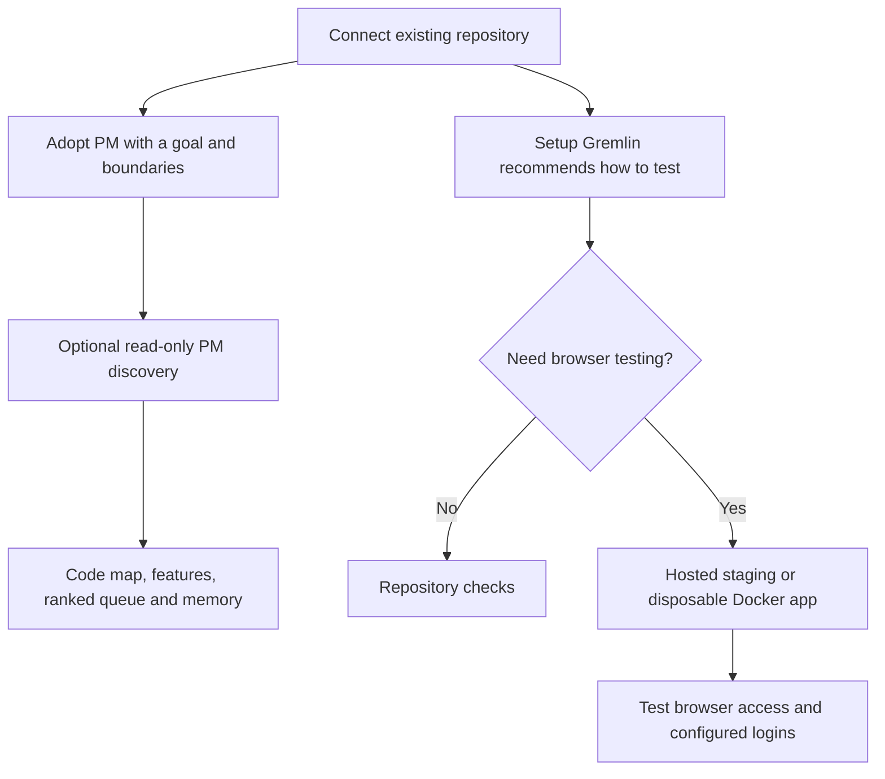
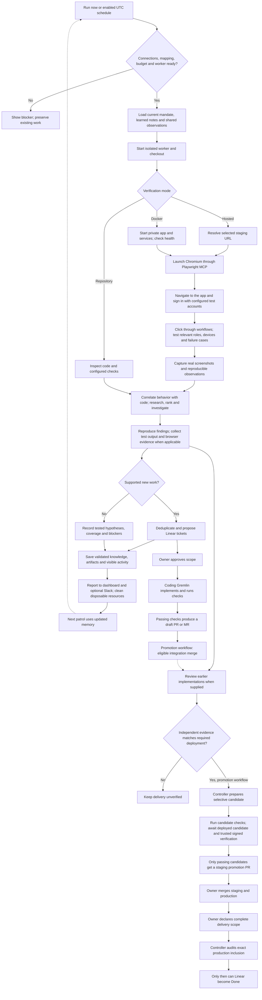

# How a PM learns and plans

A ShipGremlins PM starts with the owner's direction, learns the codebase, then
uses evidence to propose useful work. The same workflow can serve a web app,
API, internal tool, library or service. Hosting and browser access are optional
for repository verification.

## The flow at a glance

Project onboarding and a PM’s own discovery are separate steps. Existing apps can adopt a PM and begin repository discovery before browser setup. The Setup Gremlin recommends how to run the application; PM discovery learns one mandate’s part of that codebase. A new idea builds its reviewed foundation before either investigates source.

The diagram describes distinct agent instructions and controller checks. Investigation quality, prioritization, deduplication and proposal wording are prompt-directed behavior. Job admission, approved coding scope, delivery verification, and promotion gates are enforced by the controller. A successful process exit is not proof that every feature or security boundary was tested.

The project overview and PM brief show a **Patrol plan** with the selected environment, configured test-account names, and a direct **Environment & accounts** link. Its numbered steps describe the intended work, not live progress. Repository-only projects explicitly say that opening an app is not required. Discovery remains in **Learning** and does not open an application or file tickets.

Each PM run's Summary separates worker completion from **Run evidence**: recorded Playwright calls, saved image files and reported checks. Select a card to open Activity or Evidence. Calls show attempts, not successful navigation or sign-in; images can also be generated fixtures. A completed run without recorded browser calls says so. Missing or partial activity stays unavailable/incomplete, and an old run is never described using the project's newly edited environment. This display does not introduce a browser-proof completion gate for ordinary patrols.

The owning PM does not itself publish or merge promotion PRs. In the optional promotion workflow, its review feeds a separately verified candidate. Candidate promotion waits for the configured trusted signer; a PM's own review is insufficient. Owners retain staging and production merge decisions. Linear completion requires an explicit complete-scope declaration and an exact production-merge/content audit; it does not assert that a live production deployment is healthy. Ordinary pull-request mode ends with reviewed drafts, and Docker/direct-URL/Cloud Run environments do not qualify for the current Vercel/Railway promotion-review route.

## Give the PM a product brief

The PM's `mandate` states its job. An optional `charter` in its `areas.json` entry
adds the owner's ambition, goal, users, expected-to-build roadmap, non-goals,
guardrails, standing priorities and metric definition. Write the desired user
outcome and boundaries, not a fixed number of tickets.

The current owner charter and mandate outrank learned notes. Missing direction
stays unknown, and conflicting owner instructions need an owner decision. A PM
cannot turn a suggestion in memory into approval or rewrite its own charter.
Runtime rules still prohibit self-approval, merges and production actions.

In the dashboard, open **Projects**, choose an app, then choose a PM. Its page is
`/projects/<project>?pm=<area>`. **Edit brief** changes the owner direction with a
revision guard. The **Product brief**, **Discovery**, **Features**, **Ranked queue**,
**Memory** and **Activity** tabs keep each PM's context together. A direct discovery
link is `/projects/<project>?pm=<area>&tab=discovery`.

The adoption welcome screen offers **Explore the codebase** for the first
Discovery mission, or **Prepare first mission** when its setup is incomplete.
Discovery needs source access, Claude Code, and a ready worker; no Linear or
browser environment is required. Fresh ideas offer **Build the foundation** first.

**Run discovery** queues a later codebase investigation. **Run now** queues one normal
patrol without enabling automation. The **Automation** switch controls scheduled
patrols and automatic pickup of approved Coding tickets. Turning it off does not
cancel work already running. Each action shows its own missing setup requirements
with direct remedies. A remote worker must be online and enrolled for this project.

**Grumblins** generates three simulated customers from the project's briefs and
learned context. Each brings a relevant goal, personality and patience budget
to a walkthrough of the test app. Its PM investigates the observations and
retains evidence and candidate experiments for review. Start with
[Let customers try it](GRUMBLINS.md); profiles are hypotheses, not real research.

**Explore product ideas** starts a separate creative PM run. It considers the
user's whole job, unmet needs, new capabilities and alternative workflows,
including experiences the app does not have yet. The PM considers distinct
directions before filtering for feasibility, researches relevant public sources
when useful, and compares a promising concept with simpler alternatives. Private
repository and user data stay out of external searches.

Each opportunity separates observed evidence from hypotheses about demand or
value, describes a concrete user outcome, and identifies the smallest useful
milestone or experiment that could disprove the idea. Worthwhile implementable
proposals go to the mapped Linear project for your review. There is no ticket
quota or invented demand. Exploration uses the same scoped runner, budget and
proposal safeguards as a patrol; it cannot approve tickets, start Coding, edit
the product or verify releases. Its concepts and remaining questions become
learned PM knowledge for the next run.

## When to explore product ideas

Use **Explore product ideas** when you want a new direction or a better way to
serve your users. A patrol is useful for investigating current behavior; discovery
builds a map of the codebase. Exploration asks what should exist next. For a new
idea with no application yet, start with **Build foundation** in Environment.

Give the PM a concrete ambition in its **Product brief**, then start exploration
from that PM's page. You can keep automation paused. For example:

| Product                | Direction to put in the brief                                                           | Useful exploration outcome                                                                                         |
| ---------------------- | --------------------------------------------------------------------------------------- | ------------------------------------------------------------------------------------------------------------------ |
| Team planning app      | “Help a new teammate understand what matters without reading six tools.”                | A new onboarding experience, compared with a simpler guided checklist, and an experiment to test whether it helps. |
| Developer tool         | “Make our complex setup approachable to someone who has never used Docker.”             | Alternative setup experiences with a first milestone and the assumptions each depends on.                          |
| Scheduling app         | “Reduce the work before and after a booking, not just the clicks on the calendar.”      | A workflow spanning preparation and follow-up, including what could stay manual.                                   |
| Internal reporting app | “Help a manager decide what to do next, while keeping sensitive employee data private.” | A decision-focused concept, privacy boundaries, and a small test of its usefulness.                                |

Describe the users, the outcome, and the constraints you care about. Include any
known complaints or measurements as evidence; leave missing customer research
explicitly unknown. You do not need to preselect the feature or promise a market
for it.

Open the run's **Summary** for its recommendation, **Activity** for the work it
performed, and **Evidence** for saved files. The PM's **Ranked queue** and
**Memory** retain alternatives and unanswered questions. A useful result explains
the experience, why it might matter, what supports it, what is still a hypothesis,
and a cheap way to learn whether to proceed. No new Linear ticket can be the right
result when an idea needs more evidence.

Review a proposed milestone before approving its Linear ticket. **Start coding**
then finds eligible approved work on your runners. Exploration itself does not
approve the idea, start implementation, contact customers, or enable automation.

During adoption, **Meet my gremlin** proposes a name, product brief, and
operational settings from your goal, repository paths, and existing PM ownership.
The original goal stays its mandate. Use **Review full brief** and **Advanced
settings** before choosing **Adopt [name]**. Suggested users, priorities, and
measurement still need owner confirmation. Drafting does not replace discovery
of the checked-out repository or create learned knowledge. Adoption saves the
PM with automation paused; starting an investigation is a separate action.

## Discover before patrolling

A patrol must advance an investigation. It starts from the previous coverage
and unresolved questions, traces a relevant path through its callers and controls,
and attempts a safe focused test that could disprove its hypothesis. A passing
broad test suite or a few reassuring source snippets do not establish security.
The PM reports visible actions and results, saves sanitized evidence, and updates
its coverage ledger. With no supported new ticket, it explains the hypotheses
tested and why no proposal is justified. Missing access or an exhausted budget
must be reported as an incomplete investigation, not a clean bill of health.
These instructions improve the agent's investigation standard; they do not
guarantee that every run finds a defect or replace independent delivery evidence.

Codebase discovery reads the selected repository checkout and traces the PM's
scope through relevant source, tests and documentation. It identifies the
observed stack, entrypoints, capabilities, permissions, dependencies and open
questions, then drafts a ranked investigation queue.

Discovery gives the model only Read, Glob and Grep tools. It cannot install
dependencies, run shell commands or app scripts, browse a deployment, contact
Linear, create tickets or publish code. Source access is used by the trusted
worker to clone the repository; the model does not receive integration tokens.
Hosting, Linear, telemetry and notification credentials are not part of this
job. Discovery does not require a Linear project or a browser environment, and
it does not verify those connections for later patrols.

The model returns a bounded JSON object containing a public summary and four
Markdown documents. The trusted worker validates it, writes the artifacts and
records the actual checked-out commit SHA in its result. Each document also
cites that SHA, inspected scope and observation date. A requested branch or an
AI-written claim is not a substitute for trusted provenance. The controller
validates the result before retaining the notes.

| File           | Purpose                                                                                    |
| -------------- | ------------------------------------------------------------------------------------------ |
| `discovery.md` | Product/system map, roadmap coverage, evidence index and unknowns.                         |
| `features.md`  | Capabilities and interfaces, code references, runtime status, confidence and known gaps.   |
| `queue.md`     | Ranked opportunities, defects, risks and research, with dependencies and next validation.  |
| `memory.md`    | Attributable owner decisions, separate provisional observations, coverage and run journal. |

Each file is limited to 64 KiB. Learned artifacts never replace `mandate.md` or
the owner's structured charter. Validated discovery and patrol snapshots live
in the configuration directory at
`.run/pm-knowledge/<project>/<area>/latest.json`, with the source job, repository,
branch, trusted checkout SHA and completion time. A full valid snapshot replaces
the previous one only after provenance and current settings pass validation.
Failed runs and older patrols without knowledge output preserve previous notes.

Changing the project settings, PM brief or versioned mandate marks earlier
knowledge stale. It remains visible in the PM page, but the controller does not
automatically pass it to later prompts. Run discovery again to refresh it.
Enabling or pausing automation alone does not stale the notes. Retained notes
are observations at their recorded SHA; repository changes still need inspection
before treating those observations as current facts.

Prompts use bounded excerpts of learned documents: up to 12 KiB per document
and 32 KiB for all learned context, including formatting. Retained documents
take priority over manual seed notes, with space shared across retained files.
Truncation and omission are explicit. The retained artifact can be larger;
keeping notes concise and journals newest-first helps the PM see the most useful
evidence. These limits do not trim the owner brief. Neither retained notes nor
manual seed notes can override that brief.

## Observe, research, rank, propose, verify, learn

A patrol chooses useful coverage from recent changes, important risks, owner
priorities and gaps in the inventory. It can perform a broad review or a
targeted investigation. It records what it actually inspected and what it
skipped; a fixed sweep quota does not determine quality.

When relevant and available, research adds dated public primary sources and
alternative approaches. Private repository data and user information must not
be sent to external search. Provider documentation proves what that source
says, not what the app has deployed or what its users need.

Ranking connects evidence to user outcomes and the owner's ambition. A PM should
consider substantial product opportunities when the mandate calls for them,
rather than filling every run with cosmetic fixes. Serious security or
reliability risks may be more important than new features. Confidence, severity,
reach, dependencies and effort shape the ranking. There are no minimum ticket
or epic counts; no new proposal is a valid result.

Verification follows the configured mode. Repository mode uses inspected code
and actual relevant check results. Browser mode uses Playwright MCP against the
selected non-production target and real screenshots where useful. A deployed
baseline may not contain an unmerged change. Tests, observations and claims
must identify the checkout or deployment they actually cover.

The PM finishes with updated proposed knowledge artifacts and a concise visible
report of evidence, proposals, checks, failures, unknowns and owner actions.
It does not push memory branches, edit controller files, send its own Slack
messages, or leave background work to be finished after the run ends.

## Keep evidence and confidence separate

Use explicit evidence kinds: **observed-in-source**,
**documented-but-unverified**, **inferred**, **runtime-reproduced**, or
**unknown**. Confidence is high, medium or low with a short reason. A PM can be
highly confident that a permission check is absent in an inspected function
without claiming an exploit was reproduced in the app.

Every finding needs real references: full repository SHA plus files/symbols or
lines, command output, an actual screenshot, supplied telemetry with its time
window, or a public URL and access date. Missing analytics means unknown, not
zero usage. A metric route or event name does not prove instrumentation exists.
Projected impact is a hypothesis until measured.

## Write tickets a developer can use

Search the configured Linear project for duplicates first. Add new evidence to
an existing matching issue while preserving its approval and state. Never pick
a similarly named project or change the PM's mapping. New findings stay in that
PM's mapped project with its area label and `pm-proposal`.

Each proposal explains:

1. The user problem, impact, owner-goal connection and priority rationale.
2. Evidence, exact repository SHA/files, expected versus actual behavior and
   reproduction details, with inference clearly separated from observation.
3. Confidence, unknowns and what would disprove the finding.
4. A coherent proposal and alternatives; larger ideas include architecture,
   dependencies and ordered, testable milestones.
5. Observable acceptance criteria and a feasible verification method for each,
   including relevant negative, permission and failure cases.
6. Owned/shared implementation scope, review tier, compatibility risks and
   explicit out-of-scope boundaries.
7. The metric definition or risk outcome, evidence-backed expectations and a
   measurement plan where instrumentation is missing.
8. Owner decisions/access needed and relevant rollout or rollback considerations.

The PM never adds `pm-approved`, clears a needs-human block, merges, promotes
or marks Done. A tier describes scope, not permission to bypass human approval.
Coding Gremlins work approved tickets and produce tested draft PRs/MRs for
review. **Done requires the fix's PR to be merged into production and required
verification to pass.** A completed agent run, green check or staging deployment
alone does not meet that rule.
