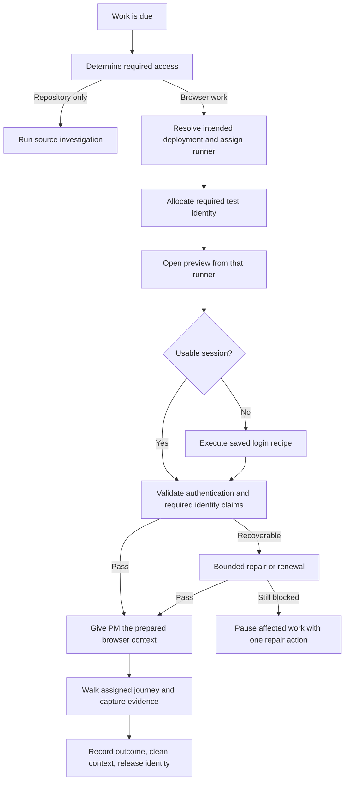

# Test access: product and implementation plan

Status: the password-access foundation is implemented in the current development branch. The broader access system below remains a product plan; it is not a claim that every adapter or repair action exists.

Implemented: inline project-scoped **Connect & test**, source-grounded password recipes, typed direct/modal/multi-step execution, actual assigned-runner verification, exclusive identity leases, a private sibling browser helper, receiving-MCP-context proof, signed-out controls, optional principal/tenant assertions, typed access failures, and fresh-session independent QA. One bounded semantic repair can replace unusable username/password/sign-in controls on a uniquely identified form; a fresh context must pass every original assertion before the receipt records it. The saved recipe is not automatically replaced. Existing password references and explicit public access remain compatible. Remote managed checks require the supported access protocol.

Verified locally with synthetic apps: real cookie and session-storage handoff, modal login, renamed login-control repair, ambiguous-form rejection, single-attempt invalid credentials, delayed public-marker rejection, identity mismatch, unsupported external redirects, public-origin boundaries, expiry, cancellation, lease shutdown, filtered/redacted MCP tools, fresh desktop/mobile QA, and the complete controller → Docker → evidence → cleanup flow. This does not establish a production ForeverMods or enterprise-provider rollout result.

Still planned: automatic browser-based flow discovery and bounded AI repair, persistent encrypted sessions, supervised SSO, inbox/OTP/MFA adapters, account pools, automatic role selection, account provisioning, test-data resets, external secret stores, and enterprise policy coverage. Sessions currently start fresh; expiry blocks the run instead of silently refreshing or falling back to public-only testing.

Basis: [sign-in setup audit](SIGN_IN_TESTING_AUDIT.md), v0.23.2 source and the live ForeverMods setup. This design evolves the existing controller, runner queue, environment resolution, private credential handling, and browser tooling; it does not require a separate service deployment.

## 1. Product promise

**Connect a test account once. Your gremlins keep their access working and ask for help only when a decision or fresh authorization is needed.**

The ordinary user should not need to understand selectors, secret names, storage state, Vercel bypass headers, or browser contexts. AI discovers the login flow; a validated runner executes it reliably. Credentials and session material stay outside model prompts and ordinary artifacts.

The supported goal is unattended testing within the app's identity policy. Some enterprise policies require human presence or a managed device. The product must disclose that boundary rather than promise to automate around it.

## 2. The first-project experience

Use one project-scoped setup journey. One decision appears at a time, with completed steps summarized above it. Keep a visible Back control and persist non-secret progress on the server. OAuth always resumes the same project and step.

### Step A: understand the project

After repository connection, a setup investigation identifies the app, likely deployment, authentication methods, existing test fixtures, user roles, and useful PM areas. It is a setup job, not an automatically adopted Product Understanding PM. Source-only investigation can happen before browser access exists; its findings are labelled as source evidence.

Reuse existing hosting and runner connections. Ask to connect a provider or start an agent service only when that dependency is missing. Resolve the repository's intended test branch/environment and actual deployment revision before browser discovery. Never choose a production deployment as a fallback.

### Step B: connect app access

When password login is found, show:

> **Give your crew a test account**
>
> We found email and password sign-in in your test app.
>
> Email: [ ]
>
> Password: [ ]
>
> Use an account in your test environment. Your gremlins may create test data while working.
>
> **Connect & test**

This is one logical question and one save operation. Generate account IDs and secret references internally. Do not ask for a role until it matters or multiple organizations make the choice ambiguous. Show “Use another sign-in method” as a secondary action, not a grid of every possible authentication system.

If the user has no test account, offer only capabilities known to work for this app:

- **Create a test account** when a supported, authorized test-tenant provisioning or fixture adapter exists. Show the target tenant and role before creation; make the operation idempotent.
- **Open test app to create one** when creation requires invitation, administrator action, or terms acceptance. Preserve setup progress.
- **Explore public pages for now** as an explicit coverage choice. It must not enable authenticated QA or claim the project is fully verified.

Do not require password authentication if the app normally uses another method. For supported code login, connect a dedicated test inbox. For supported SSO, offer “Sign in to your test account” in a controlled browser session. Show unsupported methods honestly rather than offering a button that cannot complete.

If discovery finds no login, do not equate missing evidence with a public application. Ask the one unresolved coverage question and retain “unknown” until the owner chooses public-only coverage or supplies access. An optional account must not become a blocker for a PM explicitly assigned to public pages or repository work.

### Step C: verify automatically

Show a short progress sequence: “Opening preview” → “Signing in” → “Checking access.” ShipGremlins handles deployment protection separately from app login, discovers missing navigation steps, submits credentials privately, and verifies authenticated access.

If an organization must be selected, ask “Which test workspace should the crew use?” with observed choices. If login discovery cannot identify a route, ask for the login address or offer “Show the gremlin how to sign in.” Never make a CSS selector the default repair question.

### Step D: confirm useful access and adopt the crew

Show a compact result such as:

> **Your crew can explore ForeverMods while signed in.**
>
> Test account · pm-staging preview · verified just now
>
> [Redacted screenshot of the app]
>
> Organization: verified when applicable. Permission coverage: only what was actually checked.
>
> **Continue to your suggested gremlins**

Linear setup and account creation remain resumable parts of the project journey. PM suggestions persist independently of credentials, command confirmation, and provider refreshes. Schedules activate only after the owner selects the crew and the capabilities required by each PM are ready.

## 3. Everyday experience

The project overview contains one **Test access** card. It shows the current coverage, last verified identity, environment, time, and one next action. “Manage test accounts” opens a project-scoped panel; global Connections remains an optional management surface.

| Visible state               | Meaning                                                    | Main action                |
| --------------------------- | ---------------------------------------------------------- | -------------------------- |
| Checking access             | Setup or the assigned runner is verifying access           | View progress              |
| Ready for signed-in testing | Authentication evidence satisfies the selected work        | Manage accounts            |
| Public pages only           | Explicitly limited coverage                                | Add sign-in                |
| Reconnecting                | A bounded automatic repair is underway                     | View progress              |
| Needs your help             | A particular credential, policy, or choice blocks progress | The specific repair action |
| Waiting for an account      | Another run holds the required identity                    | View active run            |

Historical success stays in history. A changed environment must not show an unexplained current failure beside old green checks. Generate the card and PM readiness from one server-side assessment of requirements and evidence.

Use a compact layout, plain status text, a restrained progress animation, reduced-motion support, and an optional activity drawer. No required nested collapsibles. Advanced controls live in a separate inspector with descriptive labels and a way to restore the last working recipe.

## 4. Architecture and ownership

Add a controller-owned **TestAccessService** and a runner-owned **AccessExecutor** inside the current application. Use the existing job transport, cancellation, event stream, and private credential channel. Reuse environment/provider logic; do not build a second Vercel setup controller.

| Record          | Responsibility                                                                                                                                                     |
| --------------- | ------------------------------------------------------------------------------------------------------------------------------------------------------------------ |
| Access profile  | Project/environment binding; public, authenticated, or synthetic-fixture coverage; authentication adapter and versioned recipe; allowed origins; required evidence |
| Test identity   | Stable ID, private credential references, expected principal/tenant when known, assigned roles, declared versus verified claims, permitted PMs and test actions    |
| Identity lease  | Exclusive run ownership by default, runner ID, expiry, heartbeat, fencing generation, cleanup status                                                               |
| Private session | Opaque handle bound to identity, environment, allowed origins, credential generation and runner compatibility; never stored in project configuration or artifacts  |
| Access receipt  | Deployment and source revision, runner identity, recipe revision, credential generation, lease generation, timestamps and structured evidence; no credentials      |
| Setup draft     | Current step, saved non-secret answers, unresolved choices, revision and continuation target                                                                       |

An account label such as “Admin” is not evidence of administrator permissions. Track separately: authenticated access, matched principal, matched tenant, declared role, verified allowed/denied actions, login-flow coverage, and product-journey coverage. A general product patrol can use proven authenticated access without claiming an unverified role; permission or tenant-isolation QA must require the corresponding evidence.

Use versioned schemas. Retain a compatibility adapter for existing public/password configuration. Profiles refer to existing credential references during migration; users should not have to re-enter saved passwords.

### Service operations

These are logical interfaces to expose through the existing authenticated dashboard/router, not a requirement for a new public API:

- `discover(project, environment, sourceRevision)`: source-backed candidates followed by runner-side browser observation.
- `connectIdentity(expectedRevision, idempotencyKey, credentialsOrSession)`: validates and atomically commits a private identity generation and metadata, then queues verification.
- `verify(profile, identity, runner)`: returns an operation handle and streams sanitized progress.
- `prepareForRun(job, accessRequirements)`: allocates identities, establishes browser access and returns opaque contexts plus evidence.
- `resumeSetup(operation, answer, expectedRevision)`: resolves one pending question without losing previous work.
- `revokeIdentity(identity)`: invalidates sessions and future use; cancels/revokes active leases and attempts provider-side logout/revocation where supported.

Use per-project locks and versioned private manifests with atomic pointer replacement for local persistence. Write a new immutable generation before committing its manifest. For a proposed recipe/configuration change, failure leaves the still-authorized working generation intact and staged generations are cleaned up. Explicit credential replacement or revocation immediately invalidates old sessions and fences their leases; failed verification must never restore those credentials' authority. Double-clicks and reconnect callbacks must not create duplicate identities or verification jobs. A stale revision returns a resolvable conflict and preserves the user's draft.

Never persist plaintext form passwords in browser storage or return saved secret values to the UI. Secret entry is write-only. Session persistence requires encrypted private storage and key management outside repository/artifact exports. Existing Connections storage can remain behind a credential-store interface while stronger stores are introduced; do not describe existing permission-restricted files as encrypted storage.

The browser/auth helper runs under a separate process identity or container from agent-accessible shell/filesystem execution. Its private state directory is not mounted into the agent workspace. A runner-owned tool gateway exposes approved browser actions and sanitized results; privileged arbitrary-code/file/network-inspection tools cannot expose the helper's secrets. Treat MCP secret substitution as a convenience, not the isolation boundary. The official [Playwright MCP documentation](https://github.com/microsoft/playwright-mcp/blob/main/README.md#security) explicitly makes that distinction. Validate the boundary with the actual allowed tool set before claiming credentials are unavailable to the model.

## 5. Learn once; execute predictably

AI is useful for recognizing app-specific login controls, finding source evidence, interpreting a changed screen, and asking a good question. It should not improvise every password submission on every patrol.

Discovery combines relevant source, existing tests, and rendered browser evidence. A candidate becomes a typed recipe with bounded actions: navigate, open modal, select a labelled control, fill a private credential reference, submit, choose an authorized tenant, wait, and assert. Prefer accessible roles/labels and stable test IDs; CSS is a fallback in the inspector. Do not accept arbitrary scripts from the model or repository as privileged authentication code.

Compile and validate recipes before execution. Keep their evidence, source identity, last working version, and failures. Separate repairable navigation from protected expectations: authentication assertion meaning, expected principal/tenant, credential destination and authorization scope cannot be weakened by AI repair. A genuine change to those expectations requires an explicit reviewed update. A changed build triggers runtime validation, not an expensive full AI reinvestigation by default. Allow one bounded AI repair for navigation/locator drift; promote the replacement only after the original authentication and identity assertions still pass.

Authentication adapters are capability-based. An adapter declares whether it can discover, provision a test identity, authenticate, renew, verify identity, revoke, capture/reuse state, and operate unattended. Unknown capabilities are unsupported, not guessed.

## 6. Every PM run

Admission can check that access is configured, but must not treat a historical green status as current execution proof. Dispatch access preparation through the actual assigned runner, including remote workers. Authenticate in the browser context that the PM will use; if a new context is unavoidable, revalidate after a private handoff.

**Implementation refinement: one private browser context with mandatory consumer validation.** The executor signs in inside an isolated sibling container. The pinned Playwright MCP package exposes `createConnection(config, contextGetter)`, so the helper gives MCP that exact authenticated context instead of transferring a storage-state file. Its `browser.isolated` option is false because the context getter already supplies a fresh, isolated context; enabling that option would ask the adapter to create another context. The helper initializes MCP and takes a snapshot through the receiving connection, then checks protected access and configured identity assertions again before admitting model work. Cookies, session storage, passwords and bypass values stay inside the helper. A fixed gateway permits ordinary UI actions and masked screenshots; it rejects evaluators, arbitrary code, storage exports, network/console inspection, file operations and page-defined tools. Browser/context loss fails closed. Independent QA uses a separate controller capability to create fresh authenticated contexts and execute bounded review recipes, without consuming a model-exported session. Docker boundary and real-browser smoke tests cover both the normal connection and this independent QA path. See [the pinned MCP API](https://github.com/microsoft/playwright-mcp/blob/main/index.d.ts).

The runner owns the entire executor → MCP → cleanup lifecycle. Independent QA/replay retains the owning run's exclusive account reservation and obtains fresh prepared contexts using the same access service, linked to the relevant identity, test data and deployment. It does not rely on a model manually exporting a session. Run-scoped state is destroyed at completion/cancellation; compatible cross-run persistence belongs to the later managed-session slice. Require this handoff protocol capability from the first release and reject incompatible runners with a clear update action.

PM tools receive only the leased identity/context handles authorized for their job. They must not receive every account in the project. Multiple-role tests use separate contexts. Public-only and fixture-backed synthetic identity are distinct modes, removing the current contradictory guidance around fixtures.

Runtime session expiry may invoke the same access service once, then resume at a safe checkpoint. Do not replay a potentially completed purchase, create, or submission after reconnecting. For uncertain side effects, inspect state or report the uncertainty. Logout/login QA uses a dedicated context and identity lease so it does not invalidate other patrols.

QA/promotion receipts bind to the tested code/deployment and required identity evidence. A setup receipt or a reused session must not mark a ticket as tested. A later login failure caused by a candidate change is a possible product regression; recipe repair must not erase the original failure or weaken its assertions.

Avoid a dependency loop in which the PM needs working login to investigate broken login. A bounded diagnostic job may inspect the signed-out login flow, source and authorized logs with the available access. If evidence ties a regression to an existing ticket, return that failure to the coder through the existing QA workflow; otherwise report uncertainty or propose work through the normal approval policy. That diagnostic run cannot pass the blocked signed-in journey. Compare with the last working non-production deployment only when it is available and permitted; never use production as the fallback.

## 7. Sessions, isolation and freshness

Every run performs a cheap live check of the acquired session. No session gets an indefinite green status. Bound persistence by the earliest provider expiry, configured maximum, credential revocation, and environment/runner compatibility constraints. Default to run-scoped sessions; add cross-run persistence only through a supported adapter and policy.

A new deployment invalidates the prior access receipt and requires a fresh check. It need not invalidate a still-valid same-environment session. A new origin, tenant, credential generation, or incompatible runner does. Never rewrite cookie domains to make an unrelated preview accept a session.

Default to one active run per account. When more PMs need the same role, allocate another approved identity or queue honestly. Browser-context isolation does not isolate server-side account data. Adapters may permit shared read-only use when the app demonstrably supports it; mutating work needs an exclusive account and, where needed, a disposable test workspace/data namespace.

Lease heartbeats and fencing prevent a disconnected worker from sharing an identity with its replacement. Stop the old worker before reallocation when possible; if isolation cannot be established, quarantine the account until its session is revoked or known expired. Cleanup failure is visible and blocks unsafe reuse.

Playwright provides reusable browser authentication state and separate contexts, but saved state is credential material and parallel mutations need identity isolation. These are building blocks, not a complete managed-access system. See [Playwright authentication](https://playwright.dev/docs/auth). Validate state portability and required storage types against the installed runner/browser version; do not assume every enterprise session can be exported.

## 8. Enterprise and unusual applications

| Scenario                                        | Planned experience and mechanism                                                                     | Boundary                                                                                |
| ----------------------------------------------- | ---------------------------------------------------------------------------------------------------- | --------------------------------------------------------------------------------------- |
| Password form, modal, email then password       | Discovered action sequence; private fields; one account form                                         | Wrong credentials do not trigger password guessing                                      |
| Code / magic link                               | Connect a dedicated test inbox; correlate recipient, request time and run; consume one valid message | No general access to personal mail; stale codes and concurrent requests remain isolated |
| TOTP                                            | Supported test-tenant adapter can obtain the factor privately when explicitly authorized             | Does not imply SMS/push/passkeys work the same way                                      |
| Company SSO                                     | Known adapter or “Complete sign-in” in a controlled browser on the intended runner                   | Never ask users to disable their normal MFA policy                                      |
| Device-bound authentication                     | Use a compatible approved runner/browser or disclose interactive-only support                        | Do not promise copying a personal browser session will satisfy device policy            |
| Multiple tenants / organizations                | Ask once for the test workspace; verify it after login and reuse that binding                        | Never silently select the first organization                                            |
| Invited accounts, onboarding, terms             | Recognize the pending step and provide an explicit owner handoff                                     | Do not automatically accept agreements or widen privileges                              |
| Account pools / multiple roles                  | Suggest relevant test roles from the app; let the owner provision or connect them incrementally      | Never treat a role name as a permissions test                                           |
| Separate auth/API domains, popups, iframes      | Adapter declares exact destination origins and data allowed at each stage                            | No global external-redirect allowance or wildcard credential scope                      |
| Private network / internal CA / client cert     | Select a compatible runner profile and verify there                                                  | Never silently turn off TLS validation                                                  |
| CAPTCHA / human-presence requirement            | Pause with a specific explanation; offer an approved test-environment integration if available       | No endless attempts or claim of unattended coverage                                     |
| Basic auth / service credentials / API-only app | Specific access adapter and explicit API/repository coverage                                         | No artificial requirement for a customer login UI                                       |
| Synthetic Docker fixture                        | Fixture adapter proves the synthetic identity and labels coverage                                    | Does not claim production authentication was tested                                     |

The supervised sign-in feature must operate inside a short-lived, owner-authorized remote browser session. The owner types directly into that browser; the model receives sanitized progress. Do not expose an unauthenticated browser/VNC/debug port or require users to upload cookies. Reuse existing owner authentication, scope the control token to one operation, require protected transport, expire control on completion, and show who currently controls the browser. Pause screenshots/traces around private input and validate sessions after handoff. If transport or the IdP prevents this path, explain the supported alternative.

Treat preview protection, app authentication, and authorization as separate layers. Vercel bypass material is sent only to its admitted preview origin, never to the IdP. Source files and page content cannot authorize a new credential destination. An existing adapter policy can cover routine redirects; a new destination requires reviewed configuration.

## 9. Recovery policy

These are initial product defaults, configurable centrally rather than presented during onboarding:

| Failure                                   | Automatic behavior                                                                                 | User-visible result                                 |
| ----------------------------------------- | -------------------------------------------------------------------------------------------------- | --------------------------------------------------- |
| Session expired                           | One fresh authentication using the supported adapter                                               | Reconnecting, then ready or one reconnect action    |
| Login control moved                       | One bounded discovery/recipe repair; retain prior assertions                                       | Repaired with evidence, or ask for the missing step |
| Explicit bad credentials / account locked | Stop after the first rejection; no credential retry loop                                           | Update test password or unlock account              |
| Wrong principal / tenant                  | Discard the session; one clean sign-in using the expected binding; quarantine if mismatch persists | Choose/correct the intended identity                |
| Preview not ready                         | Use existing deployment readiness handling; do not consume password attempts                       | Waiting for deployment                              |
| Temporary transport failure               | At most two retries with backoff within a bounded operation budget                                 | Clear network/runner diagnosis when exhausted       |
| MFA / owner action                        | Persist the operation and pause; expire the interactive control channel                            | Complete sign-in                                    |
| Unexpected origin / policy change         | Block credential transmission and preserve evidence                                                | Review the specific auth destination/policy         |
| User cancels / runner dies                | Cancel child work, revoke control handles, clean private files, resolve lease safely               | Cancelled or interrupted, never successful          |

Bound normal access preparation to three minutes by default, excluding explicitly labelled deployment waiting and supervised sign-in. Supervised sessions expire after ten minutes by default and resume through a new authorized session. Provider rate limits and stricter account policies take precedence.

Deduplicate blocked work by identity, failure reason and configuration generation. A new daily patrol must not create another identical failing run. Resume affected jobs after relevant credentials/configuration change or an explicit retry. Preserve separate access failures and product defects; publish Linear updates only through the PM's existing authorized workflow.

## 10. Work packages and release gates

Keep delivery in reviewable vertical slices. Avoid postponing runtime reliability until after UI polish.

### Slice 1: one account form, real runner verification — foundation implemented

- Add compatible access-profile and identity models, a single private save-and-verify operation, a deterministic executor for existing password recipes, and structured receipts.
- For a fresh project, apply a source-grounded password candidate when the user connects the account, then validate it. The executor also accepts bounded modal/multi-step candidates. Unknown flows remain unverified; broader rendered-browser discovery and repair belong to Slice 2.
- Replace the Environment → Connections detour with project-scoped account entry and resumable setup. Preserve existing credentials and PM suggestions.
- Dispatch verification to the selected runner. Add an authenticated-access preflight and opaque browser-context handoff for regular PM jobs.
- Include exclusive identity allocation, per-job credential minimization, private run-scoped state, cancellation/cleanup and crash quarantine in this first slice. These are prerequisites for preparing real sessions, not enterprise extras.
- Require a signed-out negative control and protected authenticated assertion before the first receipt. Verify principal/tenant whenever configured; otherwise label those claims unverified and block only work requiring them. Establish the receiving-MCP-context handoff and runner protocol compatibility gate in this slice.
- Centralize readiness so old evidence cannot masquerade as a current pass.
- **Gate:** A fresh ForeverMods project can be connected using only a dedicated account and a detected direct-password recipe, with no selector/reference editing. A real PM reaches and exercises a signed-in feature using the prepared context. Wrong credentials produce one useful action and no retry storm. Concurrency, cancellation, worker interruption and redaction tests prove that two mutating runs cannot share an identity and credentials do not appear in prompts, logs or ordinary artifacts.

### Slice 2: discovery and bounded self-repair — narrow control repair implemented

- The executor now repairs uniquely recognized login controls once before submission; ambiguity, bad credentials and assertion failures remain blocked. Broader rendered-browser discovery, AI flow repair and persisting verified recipe replacements remain future work.
- Separate source-valid authentication hints from command confirmation. Add the expert inspector and recipe history.
- Extend identity allocation with account pools, multiple-role contexts, live principal/tenant assertions where required, and recovery coverage for changed flows.
- **Gate:** direct, modal and multi-step fixture apps pass; changed controls repair without weakening assertions; two mutating PMs cannot accidentally share an identity.

### Slice 3: private sessions and supervised access

- Implement encrypted session storage/key management, expiry/revocation, runner compatibility, and scoped remote browser handoff.
- Add dedicated test-inbox and an SSO adapter chosen from a real pilot. Expose capability limits clearly.
- Distinguish login-flow testing from application testing using prepared sessions.
- **Gate:** expired sessions reconnect safely; an owner-required challenge pauses once and resumes; the first-slice secrecy/cleanup invariants also hold for persisted sessions, supervised control, screenshots, traces and normal exports.

### Slice 4: enterprise access and provisioning

- Add role/tenant coverage matrices, approved account provisioning, disposable test workspaces, network profiles, and external secret-store support.
- Implement additional provider adapters from real integration evidence rather than guessing universal compatibility.
- **Gate:** verify allow/deny behavior across two roles and tenants, remote private-network access, revoked credentials, account cleanup, and an IdP policy that legitimately prevents unattended login.

Primary code touchpoints: `dashboard/project-onboarding.js`, `dashboard/connections-view.js`, project wizard/welcome/adoption surfaces; `src/testAccess.ts`, `src/setup/environmentAccess.ts`, `environmentProbe.ts`, `environmentSetup.ts`, `environmentDiagnosis.ts`; `src/localRunners/jobs.ts`, remote-worker transport, `runner-local/browser-access.mjs`, review-session receipts and PM outcome handling. Extract new `src/testAccess/` modules as the contract grows; avoid further enlarging dashboard routing and prompt strings.

## 11. Migration, verification and rollout

Migrate existing public/password recipes lazily without resetting projects, saved credentials, Linear mappings, or schedules. Preserve legacy `neon-auth-otp` configuration as a named legacy capability with explicit unverified-login coverage until its adapter is supported; never silently turn it into public access or force a password. Existing public-only choices stay public-only. Migrating a public fixture to synthetic authenticated coverage requires fixture evidence and explicit confirmation of that coverage.

Old “passed” records become historical receipts, not proof for the new run. Existing still-authorized accounts remain usable while a proposed profile is verified. A failed verification preserves configuration for diagnosis, but explicit credential rotation/revocation remains effective. Queued jobs re-evaluate access requirements and profile generation at dispatch; in-flight jobs pin their generation unless revoked. Drain or cancel jobs before a protocol change that cannot preserve their contract. An older runner may complete compatible legacy work during rollout, but cannot claim the new authenticated preflight capability.

Roll out behind a per-project capability flag. Start with ForeverMods and the ShipGremlins Docker fixture, then exercise fixtures for direct login, modal login, multi-step login, expiry, cross-origin IdP, roles/tenants, rejected credentials, identity concurrency, changed deployment, and remote-runner failure. New enterprise modes require compatible runner protocol versions; the controller must explain version mismatch instead of silently falling back to insecure or incomplete execution.

Test the complete story, not just individual controls: connect → save → verify on runner → start PM → perform a signed-in task → expire session → recover → finish QA with current evidence. Include double-submit, refresh/OAuth resume, stale revisions, cancellation, worker restart, screenshot/log redaction, and unexpected credential destinations. Current-origin guards remain regression tests throughout.

Track setup abandonment and actions per setup, time from account submission to verified access, first-PM signed-in success, human interventions per week, repair success, duplicate retries, and authentication cost. Separate provider/user-policy blocks from product failures. The launch target for the common supported case is one account submission, zero technical fields and zero page detours; correctness gates above are mandatory regardless of speed metrics.

Rollback disables new adapters for new work while cancelling or draining active access operations safely. It must never reinterpret an SSO/session profile as public access or discard identities. Versioned manifests retain the last working configuration; revoked or superseded secrets/sessions remain revoked after rollback.
